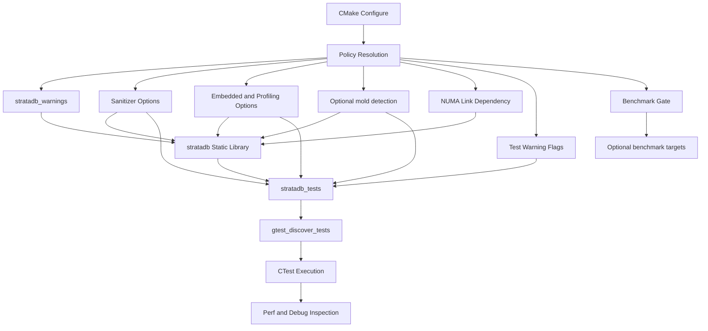

# Build and Toolchain Architecture

Author: Ankit Kumar
Date: 2026-04-17

## Last Updated
2026-04-27

## Change Summary
- 2026-04-17: Initial architecture document for the build and test toolchain.
- 2026-04-19: Expanded to systems-level format with explicit model, component rationale, tables, failure analysis, and observability guidance.
- 2026-04-20: Updated for NUMA linkage and current CMake behavior, including arena/tlab targets, sanitizer conflict checks, and test warning policy separation.
- 2026-04-23: Updated architecture navigation to include phase-3 memtable and skiplist node documentation. Synced with current `CMakeLists.txt` behavior for optional mold auto-detection, memtable source/test inclusion, and linker failure semantics.
- 2026-04-27: Synced with current build graph and options, including WAL staging source integration, benchmark gating (`STRATADB_BUILD_BENCHMARKS`), and embedded/profiling compile-profile toggles.

## Purpose
Define the exact build, test, and instrumentation model used by this repository so contributors can reason about correctness gates and runtime diagnostic workflows without reverse-engineering `CMakeLists.txt`.

## Overview
The repository builds one static library (`stratadb`) and one unit-test executable (`stratadb_tests`) using CMake, C++26, strict warnings, optional sanitizer instrumentation, and optional LTO. Optional benchmark binaries are generated only when release-mode constraints are satisfied. Toolchain behavior is centralized in one build graph so correctness checks and runtime profiling stay aligned.

## System Model
Think of this toolchain as three layers:

1. Policy layer: compiler standard, warnings-as-errors, sanitizer toggles.
2. Artifact layer: `stratadb` library and `stratadb_tests` executable.
3. Validation layer: CTest-discovered GoogleTest cases and optional perf-based inspection.

This model exists to prevent drift between local builds, CI-style checks, and profiling runs.

## Architecture / Design

| Area | Current Implementation | Why It Matters |
| --- | --- | --- |
| Build system | CMake >= 3.28 | Single declarative source for targets and options |
| Language mode | C++26 required, no extensions | Prevents compiler-specific behavior from leaking into core logic |
| Diagnostics | `stratadb_warnings` for library + explicit warning flags on `stratadb_tests` | Allows strict project warnings while avoiding warning-policy leakage into external test dependencies |
| Sanitization | `STRATADB_ENABLE_{ASAN,UBSAN,TSAN}` via shared helper | Keeps instrumentation behavior aligned between artifacts |
| Embedded profile toggles | `STRATADB_DISABLE_EXCEPTIONS`, `STRATADB_DISABLE_RTTI` | Allows constrained builds with explicit compiler flags/defines |
| Profiling toggle | `STRATADB_ENABLE_PROFILING` | Retains frame pointers for perf/flamegraph workflows |
| Linker selection | `STRATADB_USE_MOLD` + `find_program(mold)` with fallback | Keeps fast-linker optimization optional instead of hard-required |
| NUMA dependency | `stratadb` links `numa` | Enables NUMA-aware memory components in core library build |
| Core sources | memory/config/memtable + `src/wal/wal_staging.cpp` + hardware utils | Ensures WAL staging internals are built with the same policy as other core subsystems |
| Testing | `stratadb_tests` + `gtest_discover_tests(...)` | Exposes fine-grained tests through CTest without manual registration |
| Benchmarks | `STRATADB_BUILD_BENCHMARKS` gated by Release + no sanitizers | Avoids skewed benchmark results from debug/sanitizer instrumentation |

## Data Flow

## Components

### CMake Build Entry
#### Responsibility
Defines project language mode, targets, options, and test registration.

#### Why This Exists
Without a single build entry point, warning policy and sanitizer usage diverge quickly between modules and environments.

#### How It Works
`CMakeLists.txt` sets standard/compiler policy, defines options (`STRATADB_ENABLE_*`, `STRATADB_USE_MOLD`), resolves optional mold linker availability, creates targets, links dependencies, and registers tests.

#### Concurrency Model
Build graph generation is declarative; build parallelism is delegated to the underlying generator (`ninja` or `make`) and command-line flags.

#### Trade-offs
One central file improves consistency, but it can grow dense as more targets and build modes are added.

### Warning and Sanitizer Policy
#### Responsibility
Defines hard correctness gates and optional runtime race/memory instrumentation.

#### Why This Exists
Concurrency-heavy code can pass functional tests while still containing races or undefined behavior; instrumentation must be easy to enable without editing target definitions.

#### How It Works
`stratadb_warnings` is applied to `stratadb`, while `stratadb_tests` receives an explicit strict warning list through `target_compile_options(...)`. `enable_sanitizers(...)` conditionally adds compile/link flags for ASAN, UBSAN, and TSAN, and aborts configuration when ASAN and TSAN are enabled together.

#### Concurrency Model
Sanitizers instrument synchronization and memory operations at runtime; TSAN specifically observes inter-thread ordering behavior.

#### Trade-offs
Sanitizers increase build and runtime overhead, but provide higher confidence in concurrency safety.

### Build Profiles and Optional Benchmark Topology
#### Responsibility
Control compile/link profile choices for embedded constraints, profiling quality, and benchmark validity.

#### Why This Exists
One profile does not fit all workloads. Benchmark and profiling runs require different compiler behavior than constrained embedded targets.

#### How It Works
- `STRATADB_DISABLE_EXCEPTIONS` adds `-fno-exceptions` and `STRATADB_NO_EXCEPTIONS`.
- `STRATADB_DISABLE_RTTI` adds `-fno-rtti`.
- `STRATADB_ENABLE_PROFILING` adds `-fno-omit-frame-pointer -g`.
- `STRATADB_BUILD_BENCHMARKS` only materializes benchmark executables in Release mode with sanitizers off.

#### Concurrency Model
None directly at build-graph level. These options influence runtime behavior characteristics (instrumentation overhead, stack trace quality), not synchronization semantics.

#### Trade-offs
Greater flexibility for different workflows, at the cost of more build combinations to validate.

### Core Target Composition and NUMA Linkage
#### Responsibility
Build one consistent core library artifact and provide explicit linkage to NUMA APIs used by allocator components.

#### Why This Exists
Memory and memtable components must compile under the same warning/sanitizer/link assumptions, and arena code requires NUMA symbols at link time.

#### How It Works
`stratadb` includes epoch/config, arena/TLAB, and skiplist memtable/node sources in one static library target, links `numa`, and conditionally gets mold link options when enabled and found.

#### Concurrency Model
NUMA configuration influences memory locality under multi-threaded workloads; it does not replace synchronization primitives but affects where memory is allocated and accessed.

#### Trade-offs
NUMA linkage enables topology-aware behavior but adds an external system dependency that must exist on build machines.

### Artifact and Test Topology
#### Responsibility
Builds `stratadb` from source modules and validates behavior via `stratadb_tests`.

#### Why This Exists
A shared artifact graph ensures tests execute the same core code paths that production builds compile.

#### How It Works
`stratadb_tests` links `stratadb` and `GTest::gtest_main`, includes memory/config/memtable test sources (`epoch_manager`, `config_manager`, `arena`, `tlab`, `skiplist_memtable`), and is discovered via `gtest_discover_tests(...)`.

#### Concurrency Model
Test binary includes multi-threaded test cases from memory, config, and memtable modules, so runtime toolchain behavior directly affects race visibility.

#### Trade-offs
A single test binary is operationally simple, but hotspot attribution across modules can require symbol-level filtering in perf reports.

## Key Design Decisions
| Decision | Why | Alternative Rejected | Trade-off |
| --- | --- | --- | --- |
| Interface warning target (`stratadb_warnings`) | One source of truth for diagnostics | Per-target duplicated warning flags | Less local flexibility per target |
| Shared sanitizer helper | Avoids sanitizer drift across targets | Manual sanitizer flags on each target | Helper complexity in CMake logic |
| ASAN+TSAN conflict guard | Prevents invalid sanitizer combination at configure time | Let both be enabled and fail later | Stricter configuration behavior |
| Explicit embedded/profile toggles | Keep non-default build modes intentional and reviewable | Ad-hoc local compiler flag edits | More option combinations to test |
| Explicit `numa` link on `stratadb` | Guarantees NUMA symbol availability for memory subsystem | Rely on transitive/system-default linkage | Requires libnuma availability on build hosts |
| Dedicated `stratadb_tests` binary | Unified execution path for module tests | Per-module test binaries only | Mixed performance signals in one process |
| Optional mold linker (`STRATADB_USE_MOLD`) | Prefer fast linker when installed while remaining portable | Hard-require mold in all environments | Linker behavior can differ between machines |
| Benchmark gating in Release-only no-sanitizer mode | Avoid benchmark numbers dominated by instrumentation overhead | Build benchmark binaries in every profile | Benchmark workflow depends on stricter build prerequisites |

## Failure Modes
| Scenario | Cause | Impact | Mitigation |
| --- | --- | --- | --- |
| Link behavior differs across machines | mold present on one machine and absent on another | Different linker performance characteristics | Pin `STRATADB_USE_MOLD` policy in shared build presets/CI |
| Build fails at link step (NUMA) | `libnuma` unavailable while `stratadb` links `numa` | No library/test artifact output | Install NUMA development package for host OS |
| Sanitizer build fails unexpectedly | Unsupported sanitizer/runtime combo | Instrumented test run blocked | Enable one sanitizer at a time and verify compiler/runtime support |
| Configure fails before build | ASAN and TSAN are enabled together | CMake configuration stops | Enable only one of ASAN or TSAN |
| Warnings block merge | Strict `-Werror` policy | Build break on warning regressions | Fix warning at source or adjust policy intentionally with review |
| Incomplete test registration | Misconfigured `gtest_discover_tests` path | Tests silently skipped in CTest | Validate discovered tests list in CTest output |
| Benchmarks unexpectedly absent | `STRATADB_BUILD_BENCHMARKS=ON` but build is not Release or sanitizer-enabled | No benchmark binaries produced | Use Release build with sanitizers disabled for benchmark jobs |

## Observability
- Build graph and target definition: inspect `CMakeLists.txt`.
- Runtime validation path: `stratadb_tests` discovered by CTest.
- Benchmark outputs are available when benchmark gating conditions are met.
- Runtime profiling setup can be made more stable with `STRATADB_ENABLE_PROFILING`.

## Usage / Interaction
| Task | Interaction Point | Expected Outcome |
| --- | --- | --- |
| Build core library and tests | Configure and build from `CMakeLists.txt` | `stratadb` and `stratadb_tests` produced |
| Run correctness suite | Execute CTest-discovered tests | Module-level behavior validation |
| Run benchmark suite | Enable `STRATADB_BUILD_BENCHMARKS` under valid build conditions | Benchmark executables are generated |
| Inspect runtime cost | Run perf workflow with profiling mode when needed | Hotpath candidates for optimization |
| Validate NUMA linkage path | Build `stratadb` with host NUMA library available | Successful link for arena/TLAB-capable core library |

## Related Documents
- [01-epoch-reclamation.md](01-epoch-reclamation.md)
- [02-configuration-management.md](02-configuration-management.md)
- [03-memory-arena.md](03-memory-arena.md)
- [04-thread-local-allocation.md](04-thread-local-allocation.md)
- [05-skiplist-memtable.md](05-skiplist-memtable.md)
- [06-skiplist-node.md](06-skiplist-node.md)
- [07-wal-staging.md](07-wal-staging.md)

## Notes
- Not verified: exact build/test command success in this edit session.
- Not verified: portability of `STRATADB_USE_MOLD` linker-selection behavior across all developer machines.
- Not verified: portability of `numa` linkage assumptions to all developer machines.
- Not verified: benchmark result stability across different host CPU governor and NUMA topologies.
