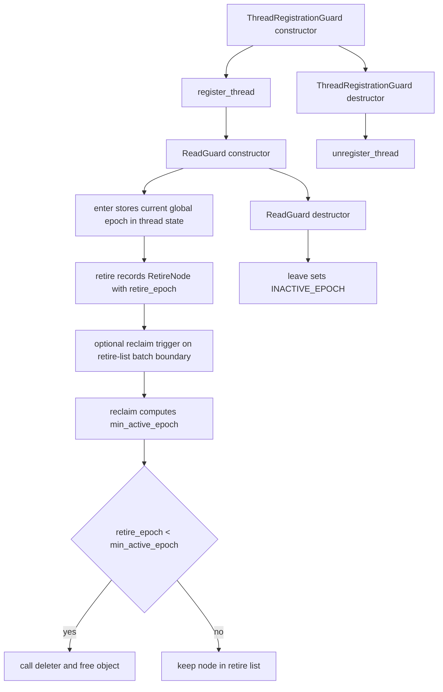
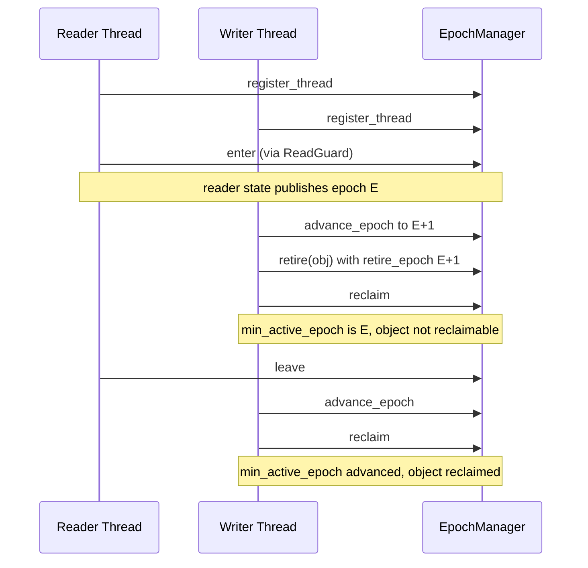
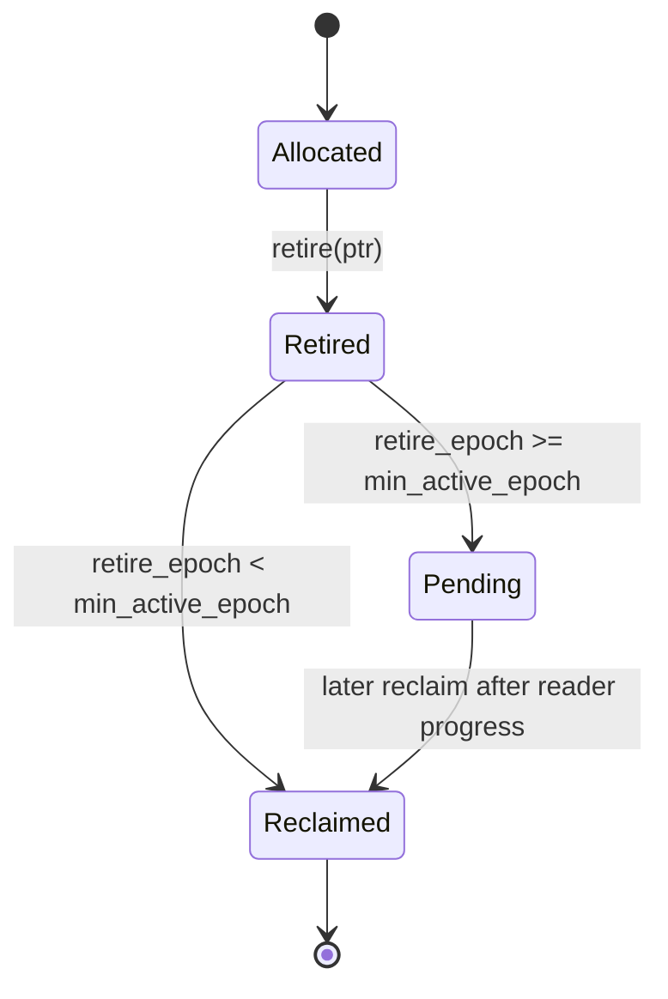

# Epoch Reclamation Architecture

Author: Ankit Kumar
Date: 2026-04-17

## Last Updated
2026-04-21

## Change Summary
- 2026-04-17: Initial architecture write-up for epoch-based reclamation.
- 2026-04-19: Expanded with explicit system model, lifecycle visualization, component-level rationale, design and failure tables, and observability workflow.
- 2026-04-21: Updated to full systems-level structure, added explicit thread interaction and memory lifecycle diagrams, documented force teardown reclaim path, and aligned failure and validation sections with current implementation and tests.

## Purpose
Document the exact safety and lifecycle model of epoch-based reclamation in StrataDB so contributors can reason about when memory can be retired, when it can be freed, and what conditions can delay reclamation.

## Overview
EpochManager provides deferred reclamation for concurrent access patterns where readers may hold references while writers retire objects. The design separates object retirement from object destruction:

1. A writer retires an object with a recorded retire epoch.
2. Active readers publish their currently observed epoch.
3. Reclaim computes the minimum active reader epoch and destroys only objects older than that boundary.

This avoids use-after-free risks without requiring readers to take a mutex.

## System Model
The system has four explicit roles:

| Role | Backing State | Lifecycle |
| --- | --- | --- |
| Global epoch timeline | global_epoch_ | Monotonic logical clock advanced by advance_epoch() |
| Registered thread slot | thread_states_[slot] and active_thread_masks_ bit | Claimed by register_thread(), released by unregister_thread() |
| Active read-side critical section | thread_states_[slot].state != INACTIVE_EPOCH | Published by enter(), cleared by leave() |
| Retired object candidate | RetireNode in retire_list_ | Added by retire(), removed by reclaim() or force_reclaim_all() |

Mental model:
- Registration gives a thread ownership of one slot.
- ReadGuard marks that slot as active for a specific epoch.
- Retire appends nodes to the owner thread slot retire list.
- Reclaim can destroy only nodes where retire_epoch < min_active_epoch.

## Architecture / Design

| Element | Implementation | Why It Matters |
| --- | --- | --- |
| Slot capacity | MAX_THREADS = 128 fixed array | Bounded metadata and stable slot addresses |
| Active slot tracking | ActiveThreadMaskWord bits | Reclaim scans only registered slots |
| Read activity marker | state with INACTIVE_EPOCH sentinel | Distinguishes active readers from inactive threads |
| Retirement queue | per-thread vector of RetireNode | Removes global lock from retire path |
| Automatic scope correctness | ReadGuard and ThreadRegistrationGuard | Ensures enter/leave and register/unregister symmetry |
| Teardown escape hatch | force_reclaim_all() | Single-threaded final drain of all retire lists |

## Data Flow

### Thread Interaction

### Memory Lifecycle

## Components

### EpochManager
#### Responsibility
Provide registration, read-side epoch publication, retirement bookkeeping, epoch advancement, and reclamation.

#### Why This Exists
Concurrent readers can observe pointers that writers have already replaced. Deleting immediately after replacement is unsafe when readers are lock-free.

#### How It Works
- register_thread() claims one free bit in active_thread_masks_ and stores slot index in thread_local thread_index_.
- enter() stores current global_epoch_ to the thread slot state.
- leave() stores INACTIVE_EPOCH.
- retire() appends RetireNode {ptr, deleter, retire_epoch} to the current thread retire list.
- reclaim() scans active thread states to compute min_active_epoch and compacts the calling thread retire list.
- force_reclaim_all() drains all retire lists without epoch checks, intended for teardown contexts.

#### Concurrency Model
- Synchronization uses atomics with acquire/release and acq_rel operations.
- Registration uses compare_exchange_weak on mask words.
- Retire list mutation is single-owner per thread slot.
- Reclaim reads other thread states, but only mutates the caller retire list.

#### Trade-offs
- Fixed capacity reduces metadata complexity but imposes hard thread limit.
- Per-thread retire lists remove global retire contention but can create uneven memory buildup.

### ThreadRegistrationGuard
#### Responsibility
Tie thread registration and unregistration to lexical scope.

#### Why This Exists
Unbalanced registration leaks slot ownership and can block new participant threads.

#### How It Works
- Constructor calls register_thread() and stores result as expected<void, EpochError>.
- Destructor calls unregister_thread() only if registration succeeded.
- result() exposes registration failure to caller.

#### Concurrency Model
Slot ownership is represented by one bit in active_thread_masks_; release happens after state is marked inactive and local reclaim is attempted.

#### Trade-offs
RAII reduces misuse risk, but callers must check is_registered() or result() when registration can fail.

### ReadGuard
#### Responsibility
Represent active read-side critical section.

#### Why This Exists
Manual enter and leave calls are error-prone in early-return or exception paths.

#### How It Works
- Constructor calls enter().
- Destructor calls leave().
- Copy and move operations are deleted to preserve one lexical owner.

#### Concurrency Model
Reader visibility is communicated through per-slot atomic state updates. Reclaim relies on this state to decide reclamation boundaries.

#### Trade-offs
Correctness is improved by RAII, but long-lived guards can delay reclamation progress and increase retained memory.

### ThreadState and RetireNode
#### Responsibility
Store per-thread reader state and deferred reclamation candidates.

#### Why This Exists
Reclamation needs both a retirement timestamp and deleter callback for type-erased destruction.

#### How It Works
- ThreadState holds atomic state and retire_list_.
- RetireNode holds ptr, deleter function pointer, and retire_epoch.
- reclaim() performs in-place compaction of retire_list_ after invoking deleters for reclaimable nodes.

#### Concurrency Model
Each retire list has a single writer and single mutator pattern bound to slot owner thread operations.

#### Trade-offs
Type-erased deleter enables generic retire API but uses indirect call on reclaim.

## Key Design Decisions
| Decision | Why | Alternative Rejected | Trade-off |
| --- | --- | --- | --- |
| Fixed slot array with MAX_THREADS = 128 | Avoid dynamic slot allocation races and pointer invalidation | Dynamically growing thread registry | Hard cap can return ThreadLimitExceeded |
| Active mask word scanning | Avoid scanning all thread states every reclaim | Full array scan of 128 slots each time | Registration and unregister pay CAS and bit operations |
| INACTIVE_EPOCH sentinel | Encode active or inactive in one atomic value | Separate bool active flag and epoch field | Sentinel semantics must remain consistent |
| Per-thread retire list | Remove shared queue lock on retire path | Global synchronized retire queue | Memory pressure can become per-thread skewed |
| Periodic reclaim trigger based on RECLAIM_MASK | Amortize reclaim work over retire calls | Reclaim on every retire | Objects can stay longer before reclamation |
| force_reclaim_all for teardown | Deterministic final cleanup in single-threaded shutdown | Wait for normal epoch progress during shutdown | Unsafe for concurrent use and should stay teardown-only |

## Failure Modes
| Scenario | Cause | Impact | Mitigation |
| --- | --- | --- | --- |
| Registration fails | All slot bits are claimed | Thread cannot participate in epoch protocol | Handle expected error and reduce participating thread count or raise limit |
| Duplicate registration on same thread | register_thread called when thread_index_ already valid | Assert failure then terminate in corrupted state path | Use ThreadRegistrationGuard and avoid manual double registration |
| Reclamation stalls | Reader keeps state active for old epoch | Retire list growth and delayed memory return | Keep ReadGuard scopes short and advance epochs in write paths |
| Excessive retire growth | retire rate exceeds reclaim progress | Higher memory footprint and potential latency from pressure | reclaim periodically, monitor list growth, and apply workload backpressure |
| Misuse of force_reclaim_all | Called while other threads still active | Potential unsafe reclamation | Restrict to teardown phases with no concurrent access |

## Observability
- Debug assertions validate registration and read-state preconditions in enter(), leave(), retire_node(), and reclaim().
- Growth pressure signal: retire_node() yields when retire list size exceeds RETIRE_LIST_THRESHOLD.
- Reclaim cadence signal: reclaim attempts occur automatically at retire-list size multiples of RECLAIM_BATCH.
- Code inspection points:
  - include/stratadb/memory/epoch_manager.hpp for API and constants
  - src/memory/epoch_manager.cpp for synchronization and reclaim algorithm
  - tests/memory/epoch_manager_test.cpp for behavioral expectations

## Validation / Test Matrix
| Test | What It Verifies | Safety Property |
| --- | --- | --- |
| SingleThreadedReclaim | Retired object freed after epoch advancement and reclaim | Basic retire to reclaim correctness |
| DeferredDeletion | Object not freed while reader active, then freed after reader exits and epoch advances | No premature reclamation |
| TSANStress | Concurrent reader and writer operations under heavy iteration | No obvious race regressions under sanitizer-oriented stress |
| BatchingBehavior | Multiple retired objects reclaimed with batched behavior | Deferred reclaim still drains candidates correctly |
| EpochStallPreventsReclaim | Active reader stalls reclamation | Min epoch boundary enforcement |
| ThreadSlotReuse | Repeated registration and unregistration | Slot recycling correctness |
| MultiEpochReclaim | Repeated retire plus epoch progression | Reclaim across epoch progression |
| ReclaimIdempotent | Reclaim called multiple times after deletion | No double free from repeated reclaim |

## Performance Characteristics
| Path | Dominant Work | Notes |
| --- | --- | --- |
| register_thread | Mask word load and CAS loop | Cost scales with contention for free slots |
| retire | Push to vector and occasional reclaim trigger check | Usually O(1), periodic reclaim introduces bursts |
| reclaim | Scan active mask bits and compact caller retire list | Cost scales with active slots plus caller retire list size |
| force_reclaim_all | Full scan of all thread retire lists | Intended for shutdown, not steady-state |

## Usage / Interaction
| Step | Caller Action | Required Condition | Result |
| --- | --- | --- | --- |
| 1 | Construct ThreadRegistrationGuard | Thread not currently registered | Thread claims one slot or receives expected error |
| 2 | Construct ReadGuard around read critical section | Successful registration | Reader epoch is published and protected from premature reclaim |
| 3 | Call retire(ptr) on replaced object | Successful registration | Object enters deferred retire list |
| 4 | Call advance_epoch() in write progress path | None | Global logical time advances |
| 5 | Call reclaim() periodically | Successful registration | Reclaimable nodes in caller retire list are destroyed |
| 6 | Destroy ThreadRegistrationGuard | Guard had successful registration | Thread marks inactive, reclaims local candidates, releases slot |
| 7 | Optional force_reclaim_all() at shutdown | No concurrent access (teardown) | All remaining retired nodes are destroyed |

## Notes
- Not verified: quantitative reclaim latency and memory high-water marks under production workloads.
- Not verified: comparative throughput versus hazard pointers or RCU variants in this repository.
