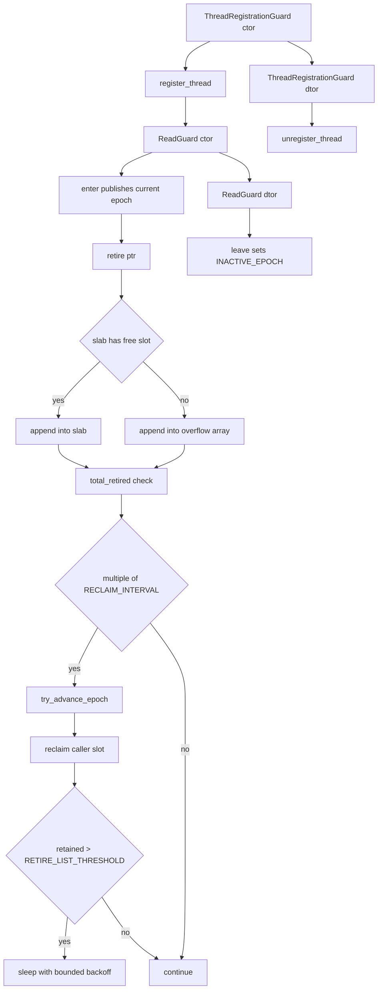
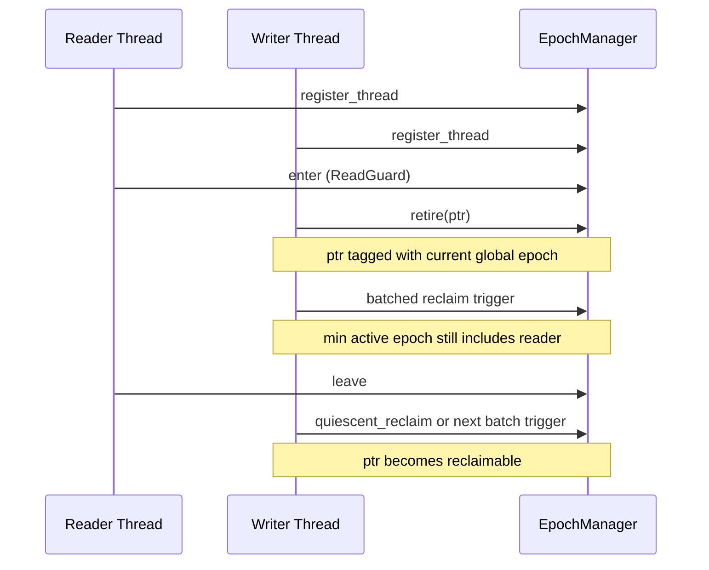
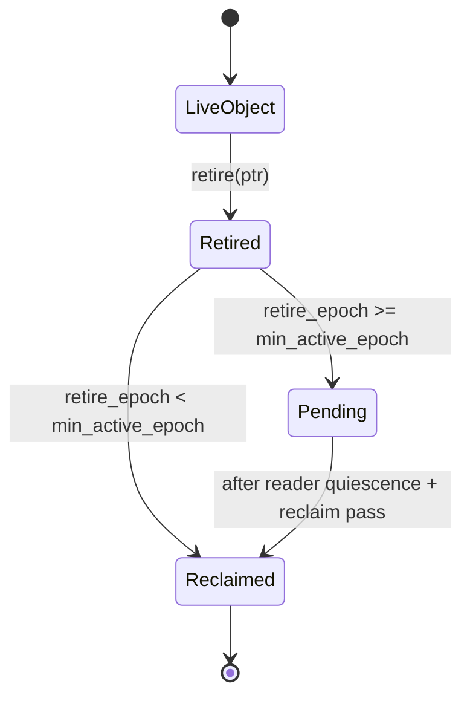

# Epoch Reclamation Architecture

Author: Ankit Kumar
Date: 2026-04-17

## Last Updated
2026-04-27

## Change Summary
- 2026-04-17: Initial architecture write-up for epoch-based reclamation.
- 2026-04-19: Expanded with explicit system model, lifecycle visualization, component-level rationale, design and failure tables, and observability workflow.
- 2026-04-21: Updated to full systems-level structure with thread interaction and memory lifecycle diagrams.
- 2026-04-22: Documented retire-side batching and pressure behavior.
- 2026-04-23: Synced public API naming and maintenance hooks.
- 2026-04-27: Rewritten to match current implementation: 256-thread capacity, per-thread slab plus overflow retire storage, adaptive sleep backoff under pressure, and per-instance thread-slot tracking.

## Purpose
Document the exact safety model for deferred memory reclamation so contributors can reason about when retired objects become reclaimable and why some objects remain retained under active readers.

## Overview
EpochManager separates logical retirement from physical destruction:

1. Writers retire pointers with the current global epoch.
2. Readers publish active read epochs through ReadGuard scopes.
3. Reclaim computes the minimum visible reader epoch.
4. Nodes retired before that minimum epoch are safe to destroy.

The implementation is tuned for cache locality and low allocator pressure by using a fixed slab first and overflow storage only when necessary.

## System Model
| Role | Backing State | Lifecycle |
| --- | --- | --- |
| Global timeline | global_epoch_ | Monotonic logical clock advanced by try_advance_epoch |
| Registered thread | active_thread_masks_ bit + slot index | Claimed by register_thread, released by unregister_thread |
| Reader critical section | thread_states_[slot].state | Set by enter, reset to INACTIVE_EPOCH by leave |
| Retired object | RetireNode in slab or overflow | Added by retire_node, removed by reclaim/force_reclaim_all |

| Capacity Parameter | Current Value | Source |
| --- | --- | --- |
| Max managed threads per EpochManager | 256 | utils::MAX_SUPPORTED_THREADS |
| Max DB instances per process | 64 | utils::MAX_DB_INSTANCES |
| Fast slab capacity per thread | 168 retire nodes | ThreadState::SLAB_CAPACITY |
| Batch interval for maintenance | 64 retired nodes | RECLAIM_INTERVAL |
| Pressure threshold | 10000 retained nodes/thread | RETIRE_LIST_THRESHOLD |

## Architecture / Design
| Element | Current Implementation | Why It Matters |
| --- | --- | --- |
| Thread registry | Bitmap words with CAS bit claims | O(1)-ish registration without global lock |
| Thread slot state | Cache-line aligned ThreadState array | Reduces false sharing between threads |
| Retire storage | Fixed slab plus dynamic overflow array | Fast common path with bounded metadata overhead |
| Reclaim cadence | retire_node batched trigger + quiescent_reclaim hook | Progress can be automatic or explicit |
| Pressure response | Adaptive sleep backoff and extra reclaim pass | Avoids unbounded retire growth under lagging readers |
| Teardown drain | force_reclaim_all | Deterministic process-shutdown cleanup |

## Data Flow

### Thread Interaction

### Memory Lifecycle

## Components
### EpochManager
#### Responsibility
Provide registration, reader-state publication, retire bookkeeping, epoch advancement, and safe reclamation.

#### Why This Exists
Concurrent read paths need pointer safety without reader-side mutex locking.

#### How It Works
- register_thread claims one free slot bit and binds thread-local slot state for this EpochManager instance.
- enter publishes current global epoch into thread state.
- retire records RetireNode into slab first; overflow is allocated and grown when slab is full.
- Every 64 retired nodes, retire path attempts epoch advance then reclaim.
- reclaim scans active thread states to compute min epoch and compacts only the caller thread retire structures.
- If retained nodes exceed threshold, retire path sleeps with exponential backoff up to 1 ms and may run an extra reclaim.
- quiescent_reclaim provides explicit maintenance hook.
- force_reclaim_all bypasses epoch checks and drains all slots.

#### Concurrency Model
- Atomics with acquire/release and acq_rel are used for registration bitmaps, epoch loads/stores, and reader-state visibility.
- Retire storage mutation is owner-thread local per slot.
- Reclaim reads all active states, mutates only caller-owned retire containers.

#### Trade-offs
Fast common-case retire behavior, but pathological long-lived readers can still cause retained memory growth.

### ThreadRegistrationGuard
#### Responsibility
Bind register/unregister symmetry to lexical scope.

#### Why This Exists
Manual lifecycle mistakes leak registration slots and can block future thread participation.

#### How It Works
Constructor stores register_thread result; destructor unregisters only if registration succeeded.

#### Concurrency Model
Slot ownership is represented by one bit in active_thread_masks_.

#### Trade-offs
Low misuse risk, but callers must still check registration result in failure-aware paths.

### ReadGuard
#### Responsibility
Represent active read-side critical section.

#### Why This Exists
Manual enter/leave patterns are fragile in early-return paths.

#### How It Works
Constructor calls enter, destructor calls leave.

#### Concurrency Model
Reader epoch is published through one atomic state field per slot.

#### Trade-offs
Long-lived guards delay reclamation.

### ThreadState Storage (Slab and Overflow)
#### Responsibility
Store pending retire nodes per registered thread.

#### Why This Exists
Global retire queues increase contention and allocator churn.

#### How It Works
- Slab stores first 168 entries inline in a page-sized ThreadState.
- Overflow array grows geometrically (starting at 256) when slab is exhausted.
- reclaim compacts both structures in place.

#### Concurrency Model
Single owner mutates slab/overflow for a slot; no shared container lock is needed.

#### Trade-offs
Excellent locality for common case, but overflow growth can terminate process on allocation failure.

## Key Design Decisions
| Decision | Why | Alternative Rejected | Trade-off |
| --- | --- | --- | --- |
| Fixed 256-slot model | Stable bounded metadata and deterministic array layout | Dynamic slot registry | Hard thread cap per manager instance |
| Bitmap slot ownership | Low-overhead registration scan and claim | Mutex-protected vector of slot states | Bit-level CAS complexity |
| Slab-first retire storage | Keep hot path allocator-free | Always heap-allocate retire nodes | Limited inline capacity per thread |
| Overflow grow-on-demand | Preserve correctness when retire bursts exceed slab | Drop retires or force immediate reclaim | Additional memory and copy overhead |
| Batched reclaim trigger in retire path | Amortize maintenance work | Reclaim on every retire | Periodic retire latency spikes |
| Adaptive sleep backoff | Cooperative pressure release under reclaim lag | Tight spin/yield loops | Throughput dips during sustained pressure |

## Failure Modes
| Scenario | Cause | Impact | Mitigation |
| --- | --- | --- | --- |
| Registration fails | No free slot among 256 thread slots | Thread cannot use epoch protocol | Handle ThreadLimitExceeded and reduce participant count |
| Duplicate registration on same thread | register_thread called when already registered | Assertion then terminate | Use ThreadRegistrationGuard |
| Overflow allocation failure | new[] fails while growing overflow retire storage | Process termination | Provision memory headroom and monitor retire pressure |
| Reclamation stalls | Reader keeps old epoch active | Memory remains retained | Keep read guards short and invoke quiescent_reclaim on write paths |
| Pressure backoff triggers frequently | Retire outpaces reclaim for one thread | Higher write-path tail latency | Tune workload and improve reclaim cadence |
| Misuse of force_reclaim_all | Called with active concurrent access | Potential unsafe reclamation | Restrict to shutdown/teardown windows |

## Observability
- Preconditions are assert-backed in register/enter/leave/reclaim paths.
- Pressure signal is visible via backoff behavior in retire_node.
- Deterministic maintenance entry point: quiescent_reclaim.
- Source inspection points:
  - include/stratadb/memory/epoch_manager.hpp
  - src/memory/epoch_manager.cpp
  - tests/memory/epoch_manager_test.cpp

## Validation / Test Matrix
| Test | What It Verifies | Safety Property |
| --- | --- | --- |
| SingleThreadedReclaim | Retire and reclaim in one thread | Basic retire-to-delete correctness |
| DeferredDeletion | Active reader delays deletion | No premature reclamation |
| TSANStress | Concurrent read/write retire behavior | No obvious race regressions under stress |
| BatchingBehavior | Reclaim progress over batched retire calls | Batch cadence correctness |
| EpochStallPreventsReclaim | Reclaim blocked by active reader | Min-active-epoch rule enforcement |
| ThreadSlotReuse | Register/unregister reuse | Slot lifecycle correctness |
| ReclaimIdempotent | Repeated reclaim calls after draining | No double free on repeated maintenance |

## Performance Characteristics
| Path | Dominant Work | Notes |
| --- | --- | --- |
| register_thread | Bitmap load and CAS retry | Scales with slot occupancy |
| retire fast path | Slab append | No heap allocation until slab full |
| retire overflow path | Dynamic array grow/copy when full | Burst-sensitive overhead |
| reclaim | Active-slot scan + in-place compaction | Cost scales with active slots and local retained nodes |

## Usage / Interaction
| Step | Caller Action | Required Condition | Result |
| --- | --- | --- | --- |
| 1 | Construct ThreadRegistrationGuard | Thread not already registered | Thread joins epoch protocol or receives explicit error |
| 2 | Use ReadGuard around read critical sections | Successful registration | Reader visibility published safely |
| 3 | Retire replaced pointers | Successful registration | Pointer enters deferred reclamation lifecycle |
| 4 | Drive progress with batched retire or quiescent_reclaim | Ongoing write/read activity | Eligible retired nodes reclaimed |
| 5 | Shutdown with force_reclaim_all | No concurrent users | Remaining retire nodes drained |

## Related Documents
- [02-configuration-management.md](02-configuration-management.md)
- [05-skiplist-memtable.md](05-skiplist-memtable.md)
- [07-wal-staging.md](07-wal-staging.md)

## Notes
- Not verified: quantitative memory high-water behavior under prolonged reader stalls in production-like workloads.
- Not verified: slot-capacity sufficiency for all deployment topologies.
