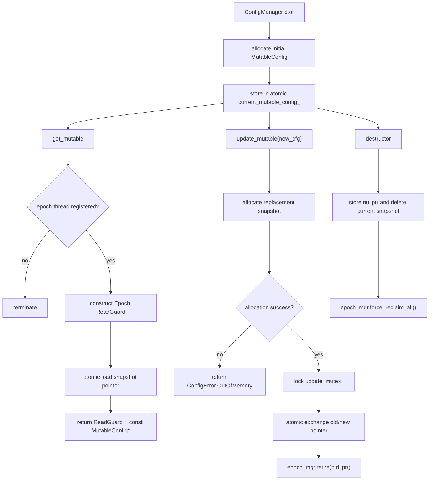

# Configuration Management Architecture

Author: Ankit Kumar
Date: 2026-04-17

## Last Updated
2026-04-23

## Change Summary
- 2026-04-17: Initial architecture document for immutable/mutable config split.
- 2026-04-19: Expanded with explicit system model, data-flow diagram, component rationale blocks, design/failure tables, and observability guidance.
- 2026-04-20: Reduced component-level verbosity and refocused on ImmutableConfig, MutableConfig, and ConfigManager runtime behavior.
- 2026-04-23: Fixed intra-doc links and added related-document navigation for memtable phase integration. Synced with current implementation for registered-thread precondition in `get_mutable()`, destructor teardown behavior, and `update_mutable()` result contract.

## Purpose
Describe how StrataDB models immutable and mutable configuration, and how `ConfigManager` publishes runtime updates safely for concurrent readers.

## Overview
Configuration in StrataDB is intentionally split into:

- Immutable startup state (`ImmutableConfig`)
- Mutable runtime state (`MutableConfig`)

`ConfigManager` coordinates publication of mutable snapshots and safe concurrent read access using epoch-based reclamation.

For epoch internals and reclamation lifecycle details, see [01-epoch-reclamation.md](01-epoch-reclamation.md).

## System Model
The subsystem uses copy-and-publish with deferred reclamation:

1. `ImmutableConfig` is stored by value and never changed after construction.
2. `MutableConfig` lives behind `std::atomic<MutableConfig*>`.
3. Readers call `get_mutable()` and receive a guard-bound snapshot pointer (registered epoch thread required).
4. Writers call `update_mutable(...)`, allocate a replacement snapshot, atomically publish it, and retire the old pointer (registered epoch thread required).
5. Old snapshots are retired and reclaimed through the epoch manager after reader quiescence.
6. Destructor clears the current pointer, deletes it immediately, then drains deferred retire lists via `force_reclaim_all()`.

This separates read consistency from write synchronization: readers get stable snapshots, writers serialize publication.

## Architecture / Design

| Layer | Primary Type | Mutation Policy | Concurrency Boundary |
| --- | --- | --- | --- |
| Immutable state | `ImmutableConfig` | Construct-time only | No runtime synchronization required |
| Mutable state | `MutableConfig` | Snapshot replacement | Read via atomic pointer + epoch guard |
| Coordinator | `ConfigManager` | Serialized publish path | `update_mutex_` and atomic exchange |

| Runtime API | Purpose | Safety Contract |
| --- | --- | --- |
| `get_mutable()` | Return current mutable snapshot | Requires registered epoch thread; guard lifetime protects referenced snapshot |
| `update_mutable(new_cfg)` | Publish replacement mutable snapshot | Returns `expected<void, ConfigError>`; old snapshot retired on success, so caller must be epoch-registered |

## System Context
- Public headers:
	- `include/stratadb/config/config_manager.hpp`
	- `include/stratadb/config/immutable_config.hpp`
	- `include/stratadb/config/mutable_config.hpp`
- Implementation:
	- `src/config/config_manager.cpp`
- Tests:
	- `tests/config/config_manager_test.cpp`

The memory safety contract for reclaimed snapshots depends on `memory::EpochManager` integration.

## Data Flow

## Components

### ImmutableConfig
#### Responsibility
Store startup-time configuration values that should not change during runtime.

#### Why This Exists
Engine invariants tied to storage layout and filesystem context must remain stable after startup.

#### How It Works
`ImmutableConfig` is held by value in `ConfigManager` and initialized once in the constructor path.

#### Concurrency Model
No runtime synchronization needed because immutable state is not updated after construction.

#### Trade-offs
Changing immutable values requires reconstructing manager state rather than in-place reconfiguration.

### MutableConfig
#### Responsibility
Define runtime-tunable settings that can be safely swapped while readers are active.

#### Why This Exists
Operational tuning such as background threads and memtable behavior must evolve at runtime without pausing all readers.

#### How It Works
Writers allocate a new `MutableConfig` snapshot and publish via atomic pointer exchange.

#### Concurrency Model
Readers view a stable snapshot pointer while holding an epoch guard; writers never mutate reader-visible snapshots in place.

#### Trade-offs
Each update allocates memory and may temporarily increase retained memory until reclamation progresses.

### ConfigManager
#### Responsibility
Coordinate publication of mutable config snapshots and safe reader access under concurrency.

#### Why This Exists
Without a publication coordinator, writers could free or overwrite snapshot data still in use by active readers.

#### How It Works
- Constructor allocates initial mutable snapshot and stores it atomically.
- `get_mutable()` verifies the caller thread is epoch-registered, then constructs an epoch guard and loads active snapshot pointer.
- `update_mutable(...)` allocates replacement, serializes writer path with `update_mutex_`, exchanges pointer atomically, retires old pointer (epoch registration required by `EpochManager::retire`).
- Destructor clears and directly deletes the current pointer, then calls `force_reclaim_all()` to drain any deferred retired snapshots.

#### Concurrency Model
- Readers are mostly lock-free after registration: epoch guard + atomic pointer load.
- Writers are serialized by mutex and publish with atomic exchange.
- Reclamation is deferred to epoch manager.

#### Trade-offs
- Read path is simple and low coordination overhead.
- Write path includes allocation, mutex lock, and deferred reclamation complexity.

## Key Design Decisions
| Decision | Why | Alternative Rejected | Trade-off |
| --- | --- | --- | --- |
| Snapshot publication via atomic pointer | Keep read path simple and avoid in-place mutation races | Shared mutable object with fine-grained locking | Extra allocations per update |
| Epoch-protected read guard | Tie pointer lifetime to explicit read participation | Reference counting every snapshot | Requires epoch discipline in all participating threads |
| Fail-fast registration check in `get_mutable()` | Prevent read snapshots without epoch participation | Best-effort fallback for unregistered threads | Unregistered callers terminate instead of degrading gracefully |
| Serialized writer path (`update_mutex_`) | Deterministic publication order and retire sequence | Lock-free multi-writer CAS loop | Lower write parallelism |
| `new (std::nothrow)` + explicit error/terminate split | Constructor treats OOM as fatal, update path returns explicit error | Exception propagation in noexcept path | Mixed fatal/non-fatal allocation policy to preserve startup invariants |

## Failure Modes
| Scenario | Cause | Impact | Mitigation |
| --- | --- | --- | --- |
| Snapshot memory growth | Updates outpace reclaim progress | Higher transient memory use | Regular epoch progress and reclaim calls |
| Mis-scoped read guard | Guard destroyed before pointer use ends | Potential unsafe access pattern at caller | Keep all snapshot dereferences inside guard scope |
| Write contention | Many writers serialize on `update_mutex_` | Higher update latency | Batch updates or reduce update frequency |
| No epoch participation in caller threads | Missing thread registration/guard discipline | Reclamation safety assumptions can break | Enforce shared thread-entry policy with epoch manager |
| Unregistered `get_mutable()` call | Caller thread not registered with `EpochManager` | Process termination by design | Register each reader thread before config access |
| Unregistered `update_mutable()` call | Writer thread not registered and retire path asserts/terminates | Process termination by design | Register writer threads with `EpochManager` before updates |

## Observability
- Correctness checks: `tests/config/config_manager_test.cpp` covers read visibility, concurrent read/write behavior, and reclamation signal.
- Inspect publication and retirement behavior in `src/config/config_manager.cpp`.
- For lifecycle/reclaim debugging details, use [01-epoch-reclamation.md](01-epoch-reclamation.md).

## Usage / Interaction
| Interaction | Caller Pattern | Expected Guarantee |
| --- | --- | --- |
| Read mutable config | Register thread with `EpochManager`, then acquire `get_mutable()` guard | Stable snapshot view during guard lifetime |
| Update mutable config | Register writer thread, provide full replacement `MutableConfig` to `update_mutable(...)`, and handle `ConfigError` | Atomic publication of new snapshot on success |
| Reclaim stale snapshots | Call `epoch.quiescent_reclaim()` from registered thread | Old snapshots eventually freed after readers quiesce |

## Related Documents
- [01-epoch-reclamation.md](01-epoch-reclamation.md)
- [05-skiplist-memtable.md](05-skiplist-memtable.md)

## Notes
- Not verified: end-to-end production workload tuning values for mutable configuration.
- Not verified: runtime policy for how often callers should invoke epoch advancement/reclaim outside tests.
- Not verified: reproducibility of attached profile percentages across toolchain/environment changes.
