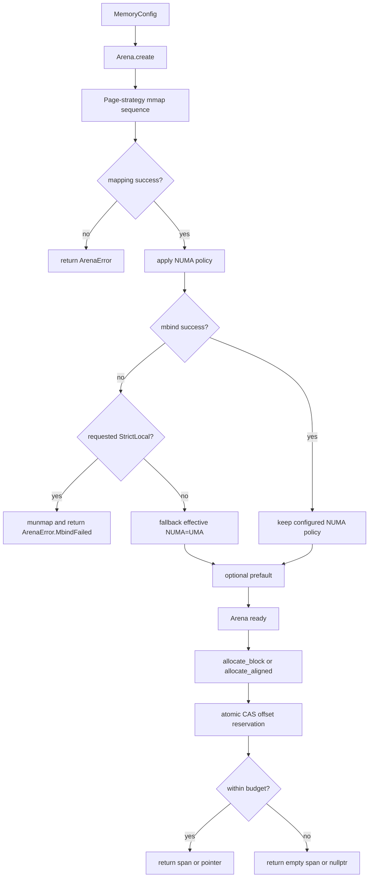

# Memory Arena Architecture

Author: Ankit Kumar
Date: 2026-04-20

## Last Updated
2026-04-21

## Change Summary
- 2026-04-20: Created architecture documentation for Arena allocation, NUMA/page strategy behavior, and validation/perf workflow.
- 2026-04-21: Reworked into full systems-level format, corrected strict-local NUMA failure semantics, added explicit thread interaction and memory lifecycle diagrams, and expanded failure and validation matrices.

## Purpose
Document how Arena reserves and serves bounded memory to concurrent subsystems, how configuration drives mapping and placement behavior, and which guarantees and failure modes callers must handle.

## Overview
Arena is a monotonic allocator over one mapped region. It is configured once at creation and then serves concurrent allocations through an atomic offset cursor. The design separates one-time environment setup from steady-state allocation:

1. Create phase: mmap strategy selection, optional NUMA policy application, optional prefault.
2. Allocation phase: lock-free offset reservations through compare_exchange loops.
3. Reuse phase: explicit reset rewinds the cursor; there is no per-allocation free.

## System Model
Arena follows a reserve-and-slice model:

| Stage | Input | Internal State | Output |
| --- | --- | --- | --- |
| Create | MemoryConfig | base_ mapped, config_ stored, offset_ = 0 | expected<Arena, ArenaError> |
| Block allocate | min_size | aligned block size and aligned cursor offset | span<byte> or empty span |
| Aligned allocate | size and alignment | aligned cursor offset | pointer or nullptr |
| Reset | none | offset_ set to 0 | allocator reusable from beginning |

Thread ownership and synchronization model:
- Arena is intended to be shared by multiple threads.
- Synchronization uses one atomic cursor offset_ with compare_exchange_weak.
- No internal locks or freelists are used for steady-state allocations.

Memory lifecycle model:
- Virtual memory region is acquired once with mmap.
- Allocations carve forward-only ranges from base_.
- Memory is released only on Arena destruction via munmap.
- reset() does not unmap; it only rewinds allocation state.

## Architecture / Design

| Area | Implementation | Why It Matters |
| --- | --- | --- |
| Config source | include/stratadb/config/memory_config.hpp MemoryConfig | Centralized page, NUMA, budget, and alignment controls |
| Backing memory | mmap reservation in Arena::create | Single contiguous address space backing |
| Placement policy | apply_numa_policy with mbind | Controls locality intent at create time |
| Allocation cursor | atomic<size_t> offset_ | Lock-free shared reservation path |
| Block API | allocate_block(min_size) | TLAB and similar clients can request block-sized spans |
| Aligned API | allocate_aligned(size, alignment) | Direct aligned reservations for larger requests |

| Policy Dimension | Options | Runtime Effect |
| --- | --- | --- |
| Page strategy | Standard4K, Huge2M/Huge1G with strict or opportunistic modes | Controls mmap flag sequence and fallback behavior |
| NUMA policy | UMA, Interleaved, StrictLocal | Controls mbind mode and failure handling |
| Prefault | prefault bool | Performs up-front memory touch by memset |
| Block alignment | block_alignment_bytes | Defines alignment for block cursor movement |

## Data Flow


  ### Thread Interaction
  ```mermaid
  sequenceDiagram
    participant T1 as Thread 1
    participant T2 as Thread 2
    participant A as Shared Arena

    T1->>A: allocate_block(min_size)
    T2->>A: allocate_aligned(size alignment)
    Note over A: each call loads current offset
    A->>A: align candidate offset and compute next
    A->>A: CAS offset old to next
    Note over A: one caller may retry on CAS failure
    A-->>T1: span or empty
    A-->>T2: pointer or nullptr
  ```

  ### Memory Lifecycle
  ```mermaid
  stateDiagram-v2
    [*] --> Unmapped
    Unmapped --> Mapped: Arena.create mmap success
    Mapped --> PlacementApplied: mbind success or UMA fallback
    PlacementApplied --> Ready: optional prefault completed
    Ready --> Allocating: allocate_block or allocate_aligned
    Allocating --> Ready: successful reservation
    Allocating --> Exhausted: budget bound hit
    Exhausted --> Ready: reset
    Ready --> Unmapped: destructor munmap
  ```

## Components

### Arena
#### Responsibility
Reserve mapped memory and provide concurrent block allocations from a monotonic cursor.

#### Why This Exists
Threaded allocation paths need low-overhead reservation without allocator-global lock contention for each medium-sized block.

#### How It Works
- create(config) attempts mapping according to configured page strategy.
- On mapping success, NUMA policy is applied.
- If StrictLocal NUMA policy fails, mapping is released and create returns MbindFailed.
- allocate_block(min_size) allocates max(min_size, tlab_size_bytes), aligned to block_alignment_bytes.
- allocate_aligned(size, alignment) reserves exactly size bytes at requested alignment.
- reset() sets offset_ to zero.

#### Concurrency Model
Allocation APIs use one shared atomic cursor with CAS retry loops. There are no locks or per-thread ownership requirements for Arena itself.

#### Trade-offs
- Concurrent allocation path is compact and predictable.
- Lack of fine-grained free can increase transient memory pressure until reset or destruction.

### Memory Policy Integration
#### Responsibility
Translate configuration policy into mapping and placement behavior.

#### Why This Exists
The same allocator must run on systems with different huge-page and NUMA capabilities.

#### How It Works
MemoryConfig drives page strategy, NUMA placement mode, prefault behavior, tlab_size_bytes, total_budget_bytes, and block alignment. Opportunistic page modes attempt huge pages and then fallback.

#### Concurrency Model
Policy is immutable during arena lifetime and not synchronized at allocation-time.

#### Trade-offs
Startup path is more complex, but runtime allocation path stays simple.

### NUMA and Mapping Path
#### Responsibility
Apply NUMA placement and robust fallback when placement cannot be enforced.

#### Why This Exists
Strict policy-only allocation would fail on hosts without compatible NUMA setup.

#### How It Works
After mapping, mbind is applied per policy:
- UMA: treated as success without mbind.
- Interleaved: mbind failure falls back to effective UMA policy.
- StrictLocal: mbind failure causes munmap and create returns MbindFailed.

#### Concurrency Model
Placement is applied once during create; ongoing allocations are lock-free cursor operations.

#### Trade-offs
Interleaved fallback improves availability, while StrictLocal favors placement guarantee over availability.

### Cursor Reservation Path
#### Responsibility
Provide race-safe reservation of non-overlapping memory ranges.

#### Why This Exists
Multiple callers may allocate concurrently, and reservations must never overlap.

#### How It Works
- Load old cursor value.
- Align candidate offset.
- Check boundary against total_budget_bytes.
- Attempt CAS to commit next offset.
- Retry if CAS fails due to race.

#### Concurrency Model
Single atomic variable serializes reservations by CAS success ordering.

#### Trade-offs
CAS retries can rise under contention, but no lock convoying is introduced.

## Key Design Decisions
| Decision | Why | Alternative Rejected | Trade-off |
| --- | --- | --- | --- |
| Atomic monotonic offset allocation | Keep multi-threaded block reservation lock-free | Per-thread mutex-protected freelists in Arena | No granular free/return path |
| Opportunistic huge-page fallback chain | Survive on hosts lacking huge pages | Strict-only page strategy by default | Runtime page size may be smaller than requested |
| Interleaved NUMA fallback to UMA | Preserve allocator availability when interleaving is unavailable | Hard fail on all NUMA placement errors | Effective policy may differ from requested interleaving |
| StrictLocal hard-fail on mbind failure | Preserve strict locality intent when requested | Silent fallback to UMA | Reduced availability on unsupported hosts |
| Empty-span OOM signaling | Keep hot path noexcept and branchable | Throwing allocation exceptions | Caller must check span emptiness |
| Separate aligned allocation API | Allow exact-size aligned reservations without block-size floor | Only block allocator interface | Larger surface area to maintain |

## Failure Modes
| Scenario | Cause | Impact | Mitigation |
| --- | --- | --- | --- |
| Create fails with `MmapFailed` | Mapping fails for all attempted strategies | Arena unavailable | Reduce budget or use simpler page strategy |
| Create fails with `OutOfMemory` | Kernel returns `ENOMEM` | Arena unavailable under pressure | Lower total budget or free system memory |
| Create fails with `MbindFailed` | StrictLocal placement cannot be applied | Arena unavailable by policy | Use UMA or Interleaved policy where strict locality is not required |
| Allocation returns empty span | Cursor crosses budget bound | Caller cannot obtain new block | Handle OOM path and/or increase budget |
| Aligned allocation returns nullptr | Invalid alignment or insufficient remaining capacity | Caller cannot obtain aligned allocation | Validate alignment and handle nullptr path |
| Effective NUMA differs from requested Interleaved mode | mbind failure under Interleaved policy | Different locality behavior than requested | Inspect host NUMA support and runtime behavior |

## Observability
- Source of truth:
  - include/stratadb/memory/arena.hpp
  - src/memory/arena.cpp
  - include/stratadb/config/memory_config.hpp
  - tests/memory/arena_test.cpp
- Runtime usage indicator: memory_used() relative to capacity().
- Allocation correctness indicator: empty span or nullptr paths on boundary exhaustion.
- Policy behavior indicator: create() error codes distinguish mmap, ENOMEM, and strict-local mbind failures.

## Validation / Test Matrix
| Test | What It Verifies | Safety Property |
| --- | --- | --- |
| Initialization | create success with basic config | Base mapping and zero initial usage |
| AllocateBlockBasic | block allocation floor at tlab size | Consistent block size policy |
| AllocateBlockLarge | large request alignment and size floor | Boundary and alignment correctness |
| Alignment | returned span pointer alignment | Block alignment contract |
| OutOfMemory | empty span on exhaustion | Explicit non-throwing OOM behavior |
| Reset | cursor rewind behavior | Reuse from start after reset |
| MoveSemantics | moved-from safety and moved-to continuity | Ownership transfer safety |
| NoOverlap | unique starting addresses for sequential blocks | Non-overlapping reservations |
| NearBoundary | boundary rejection near capacity edge | Capacity guard correctness |
| ConcurrentAllocation | multi-threaded block reservation | CAS-based race-safe allocations |
| RandomStress | randomized allocation sequence within capacity | Cursor accounting stability |
| NumaPolicyDoesNotCrash | interleaved policy creation path | Availability under NUMA variability |
| PrefaultDoesNotCrash | prefault creation path | Initialization robustness with prefault |

## Performance Characteristics
| Path | Dominant Work | Notes |
| --- | --- | --- |
| create | mmap, optional mbind, optional memset prefault | One-time startup cost |
| allocate_block | alignment math and CAS loop | Contention-sensitive retry count |
| allocate_aligned | alignment math and CAS loop | Similar contention profile to allocate_block |
| reset | single atomic store | O(1) state rewind |

## Usage / Interaction
| Step | Caller Action | Required Condition | Expected Outcome |
| --- | --- | --- | --- |
| 1 | Fill MemoryConfig | Valid budget and alignment values | Page, NUMA, and block behavior configured |
| 2 | Call Arena::create(cfg) | Host supports requested mapping or fallback path | expected value or explicit ArenaError |
| 3 | Call allocate_block(min_size) for block clients | Arena created successfully | Aligned span or empty span |
| 4 | Call allocate_aligned(size, alignment) for exact aligned reservation | Power-of-two alignment | Pointer or nullptr |
| 5 | Call reset() only when caller-level lifecycle allows rewind | Caller can tolerate reusing previous region from start | Cursor rewound to zero |

## Notes
- Not verified: strict-local mbind failure behavior in automated tests (current suite validates interleaved and prefault success paths).
- Not verified: contention scaling characteristics at higher thread counts than current concurrent test coverage.
