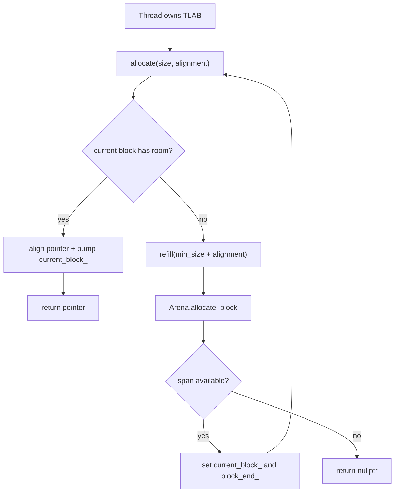

# Thread-Local Allocation (TLAB) Architecture

Author: Ankit Kumar
Date: 2026-04-20

## Last Updated
2026-04-20

## Change Summary
- 2026-04-20: Created architecture documentation for TLAB fast-path allocation, refill behavior, and interaction with Arena and memory policy.

## Purpose
Document how `TLAB` provides thread-local fast-path allocations, when it refills from `Arena`, and how the design balances low per-allocation overhead against bounded memory budgets.

## Overview
`TLAB` is a lightweight bump-pointer allocator owned by a thread context and backed by `Arena` blocks. It performs alignment-aware pointer movement in a local block and uses `refill(...)` only when local capacity is insufficient.

Policy from `include/stratadb/config/memory_policy.hpp` influences TLAB behavior indirectly through arena block sizes (`tlab_size_bytes`) and total memory budget.

## System Model
TLAB follows two paths:

1. Fast path: satisfy request from current local block with alignment fixup.
2. Slow path: request a new span from Arena via `refill(min_size + alignment)`.

The thread continues allocating from its local span until exhausted. This limits global allocator interaction to refill boundaries.

## Architecture / Design

| Layer | Implementation | Why It Matters |
| --- | --- | --- |
| Local state | `current_block_`, `block_end_` in `TLAB` | Keeps hot path thread-local pointer arithmetic |
| Global source | `Arena::allocate_block(...)` | Centralized budget and mapping control |
| Refill trigger | Fast-path bound check failure | Limits global interactions to block transitions |
| Alignment handling | `(ptr + align - 1) & ~(align - 1)` | Supports caller-required alignment guarantees |

| Allocation Path | Condition | Result |
| --- | --- | --- |
| Fast path | `new_current <= block_end_` | Return aligned pointer from current span |
| Slow path | Current span null/insufficient | Refill from arena, then retry |
| OOM path | Arena returns empty span | Return `nullptr` |

## Data Flow

## Components

### TLAB
#### Responsibility
Provide low-overhead per-allocation pointer bumping in a thread-local block.

#### Why This Exists
Requesting every small object from a shared allocator increases synchronization and cache contention under multi-threaded workloads.

#### How It Works
`allocate(size, alignment)` computes aligned address and checks whether the new pointer stays within the current span. If so, it advances `current_block_` and returns the aligned pointer.

#### Concurrency Model
TLAB object state is intended to be thread-confined. The hot path does not use atomics or locks.

#### Trade-offs
Fast path is cheap, but memory cannot be returned per-object; reclamation happens at arena policy boundaries.

### Refill Path (TLAB -> Arena)
#### Responsibility
Bridge local exhaustion to global block reservation.

#### Why This Exists
TLAB alone has no backing memory source; Arena provides bounded global capacity and policy-based allocation behavior.

#### How It Works
`refill(min_size)` calls `arena_->allocate_block(min_size)`. On success it sets local pointers. On failure it returns false and allocation returns `nullptr`.

#### Concurrency Model
Refill enters Arena's concurrent block-reservation path, which uses an atomic cursor.

#### Trade-offs
Refill frequency controls contention and waste: larger blocks reduce refill calls but can increase per-thread slack memory.

### Memory Policy Coupling
#### Responsibility
Define allocator budget and preferred block size through `MemoryConfig` consumed by Arena.

#### Why This Exists
TLAB behavior should be configurable without hardcoding per-platform assumptions.

#### How It Works
`tlab_size_bytes` and `total_budget_bytes` in `memory_policy.hpp` shape Arena blocks and OOM boundary behavior observed by TLAB.

#### Concurrency Model
Policy values are fixed at arena creation; TLAB reads behavior through arena outcomes, not mutable policy state.

#### Trade-offs
Static sizes simplify runtime behavior but may require tuning for workload size distributions.

## Key Design Decisions
| Decision | Why | Alternative Rejected | Trade-off |
| --- | --- | --- | --- |
| Thread-local bump allocation | Minimize allocator overhead on frequent small allocations | Always allocate via shared global allocator | Requires refill handoff and local state discipline |
| Refill using `min_size + alignment` | Avoid immediate post-refill failure due to alignment shift | Refill with `min_size` only | Slightly larger block consumption in edge alignments |
| `nullptr` OOM signaling | Keeps allocation path noexcept and explicit | Throwing on allocation failure | Caller must handle null-return contract |
| Arena-backed policy control | Reuse unified budget/page/NUMA policy | Standalone TLAB mmap per thread | More coupling to Arena semantics |

## Failure Modes
| Scenario | Cause | Impact | Mitigation |
| --- | --- | --- | --- |
| Allocation returns `nullptr` under load | Arena budget exhausted | Thread cannot allocate additional memory | Increase budget or reduce per-thread allocation pressure |
| Frequent refill overhead | `tlab_size_bytes` too small for request distribution | More global allocator traffic | Tune TLAB block size in memory policy |
| Excess slack memory | `tlab_size_bytes` too large for request distribution | More stranded memory per thread | Tune block size downward |
| Incorrect sharing of one TLAB across threads | Caller misuse of ownership model | Data races/undefined behavior risk | Keep one TLAB instance per thread context |

## Observability
- Source of truth:
  - `include/stratadb/memory/tlab.hpp`
  - `src/memory/tlab.cpp`
  - `include/stratadb/memory/arena.hpp`
  - `include/stratadb/config/memory_policy.hpp`
- Correctness tests: `tests/memory/tlab_test.cpp` (basic allocation, alignment, refill trigger, boundary behavior, large allocation, OOM, stress, alignment torture).
- Full test run status (current workspace): all 37 discovered tests pass.
- Heavy run status: `perf/gtest_heavy_release.log` shows 40 repeated full-suite passes.
- Perf artifact for workload context: `perf/perf_report_release.txt`.

## Performance Characteristics
- Fast-path allocation: O(1) pointer bump with alignment arithmetic
- Refill path: one Arena block request when local block is exhausted
- OOM path: O(1) null-return after failed refill

### Notes
- Runtime cost is dominated by fast-path pointer arithmetic when `tlab_size_bytes` is tuned for workload size distribution
- Not a primary bottleneck in the current heavy test profile; dominant samples are in config/epoch stress paths

## Usage / Interaction
| Step | Caller Pattern | Expected Guarantee |
| --- | --- | --- |
| Create arena | `Arena::create(MemoryConfig)` | Global mapped memory source is prepared |
| Create thread-local allocator | `TLAB tlab(arena)` per thread | Thread has local fast allocation state |
| Allocate object memory | `tlab.allocate(size, alignment)` | Returns aligned pointer or `nullptr` |
| Handle OOM | Check return pointer | Safe failure path without exceptions |

## Notes
- Not verified: cross-socket NUMA performance gains attributable specifically to TLAB+Arena under production traffic.
- Not verified: release-only cycle distribution for TLAB functions, because profile hotspots are dominated by broader stress tests in current perf run.
