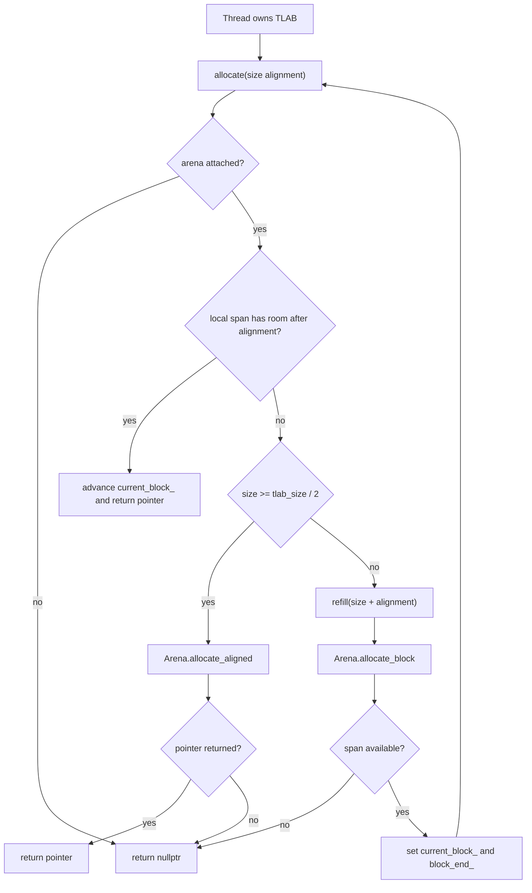
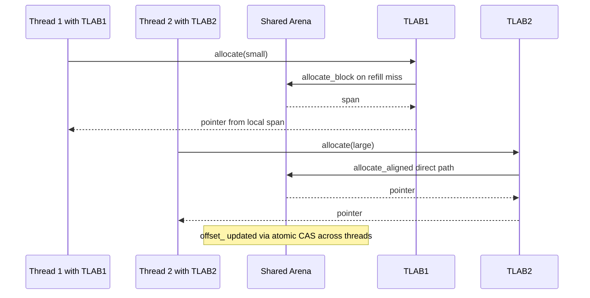
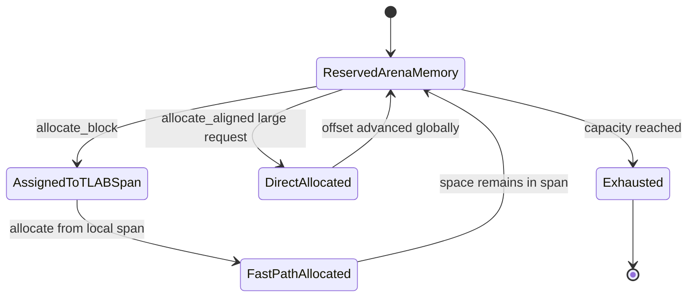

# Thread-Local Allocation (TLAB) Architecture

Author: Ankit Kumar
Date: 2026-04-20

## Last Updated
2026-04-23

## Change Summary
- 2026-04-20: Created architecture documentation for TLAB fast-path allocation, refill behavior, and interaction with Arena and memory policy.
- 2026-04-21: Reworked into full systems-level structure, corrected slow-path decision rules to match implementation, added explicit thread interaction and memory lifecycle diagrams, and expanded failure and validation coverage.
- 2026-04-23: Added related-document navigation for skiplist memtable and node integration. Synced slow-path guards to current implementation, including overflow check on `size + alignment` before refill.

## Purpose
Document how TLAB performs thread-local bump allocation, how it escalates to Arena on misses, and what correctness and performance trade-offs follow from the current implementation.

## Overview
TLAB is a thread-confined allocator that serves small allocations from a local span and calls into Arena only on slow paths. It has three behavior classes:

1. Fast path: allocate from current local span with alignment fixup.
2. Direct Arena path: for large requests where size >= tlab_size / 2, bypass local span and allocate directly from Arena.
3. Refill path: for smaller misses, request a new block from Arena via refill(size + alignment), then retry fast path.

On failure in any Arena-backed step, allocation returns nullptr.

## System Model
The allocation lifecycle is intentionally split between thread-local state and shared global state:

| State | Owner | Storage | Transition Trigger |
| --- | --- | --- | --- |
| Uninitialized local span | TLAB instance | current_block_ == nullptr, block_end_ == nullptr | Construction or detach() |
| Active local span | TLAB instance | current_block_ .. block_end_ | refill() success |
| Direct global allocation | Arena | shared offset_ cursor | allocate_slow() with large request |
| Exhausted or detached | TLAB instance | arena_ == nullptr or Arena OOM | detach() or failed Arena allocation |

Thread ownership model:
- One TLAB instance is expected to be used by one thread.
- Arena is shared across threads and uses atomic cursor updates.

Memory lifecycle:
- Arena reserves backing virtual memory at creation.
- TLAB allocations carve non-overlapping regions from Arena-reserved space.
- No per-allocation free exists in TLAB; memory is reclaimed only by Arena reset or teardown scope.

## Architecture / Design

| Layer | Implementation | Why It Matters |
| --- | --- | --- |
| Local state | current_block_, block_end_, arena_ in TLAB | Keeps hot path as thread-local pointer arithmetic |
| Global source | Arena allocate_block(...) and allocate_aligned(...) | Centralized budget control and cross-thread sharing |
| Refill trigger | Fast-path bound check failure | Limits global interactions to block transitions for small allocations |
| Alignment handling | (ptr + align - 1) & ~(align - 1) | Supports caller-required power-of-two alignment |
| Overflow defense | `size > max - alignment` short-circuit | Prevents wraparound before refill request sizing |
| Detach gate | detach() sets arena_ to nullptr | Prevents post-teardown use of backing Arena |

| Allocation Path | Condition | Result |
| --- | --- | --- |
| Fast path | current_block_ valid and aligned new_current <= block_end_ | Return aligned pointer and advance current_block_ |
| Direct path | size >= tlab_size / 2 | Call Arena::allocate_aligned(size, alignment) |
| Refill path | Small request misses local span | refill(size + alignment), then retry allocate() |
| Detached path | arena_ == nullptr | Return nullptr |
| OOM path | Arena returns empty span or nullptr | Return nullptr |

## Data Flow

### Thread Interaction

### Memory Lifecycle

## Components

### TLAB
#### Responsibility
Provide low-overhead per-allocation pointer bumping in a thread-local block.

#### Why This Exists
Routing every small allocation through shared atomic allocation would increase contention and cache traffic.

#### How It Works
- allocate(size, alignment) validates alignment is a power of two.
- It computes aligned_ptr from current_block_ and checks overflow and end bounds.
- On success it advances current_block_ and returns aligned_ptr.
- On miss it routes to allocate_slow(size, alignment).

#### Concurrency Model
TLAB internal pointers are unsynchronized and expected to be thread-confined. Sharing one TLAB instance across threads is outside the intended model.

#### Trade-offs
Very low overhead in hot path, but no object-level free and no built-in cross-thread safety for a single TLAB object.

### Slow Path and Refill
#### Responsibility
Handle local-span misses and choose between direct Arena allocation and refill.

#### Why This Exists
Without this path, local exhaustion would either fail allocations too early or require a much larger permanent local span.

#### How It Works
- If arena_ is null, return nullptr.
- Read tlab_size from Arena.
- If size >= tlab_size / 2, call Arena::allocate_aligned directly.
- If `size + alignment` would overflow `size_t`, fail with nullptr before refill.
- Otherwise call refill(size + alignment) and retry allocate.
- refill(min_size) requests a block from Arena::allocate_block(min_size) and updates current_block_ and block_end_ on success.

#### Concurrency Model
This path enters shared Arena allocation APIs, which use an atomic offset cursor with compare_exchange_weak.

#### Trade-offs
Large requests bypass local span to avoid consuming TLAB blocks, but increase frequency of shared atomic allocation operations.

### Arena Coupling and Detach
#### Responsibility
Define backing memory limits and provide safe lifecycle boundary between TLAB and Arena.

#### Why This Exists
TLAB has no independent memory source; it must rely on Arena capacity, block alignment, and teardown order.

#### How It Works
- Arena configuration determines tlab_size(), block alignment, and total capacity.
- detach() clears local pointers and arena reference.
- After detach(), all allocate calls return nullptr.

#### Concurrency Model
Detach is a local pointer state transition without synchronization. Caller is responsible for ordering detach relative to other thread activity.

#### Trade-offs
Explicit detach avoids dangling Arena access but requires callers to enforce correct teardown sequencing.

## Key Design Decisions
| Decision | Why | Alternative Rejected | Trade-off |
| --- | --- | --- | --- |
| Thread-local bump allocation | Minimize allocator overhead on frequent small allocations | Always allocate via shared global allocator | Requires refill handoff and local state discipline |
| Direct Arena allocation for requests >= tlab_size / 2 | Avoid refilling local block for large requests | Always refill on miss | More shared allocator contention for large objects |
| Refill using size + alignment | Reduce immediate retry failure due to alignment padding | Refill with size only | Can request slightly larger block than raw size |
| nullptr failure signaling | Keep allocation path noexcept and explicit | Throwing allocation exceptions | Caller must handle null returns on OOM and detach |
| detach gate before Arena teardown | Prevent accidental use of retired Arena backing | Implicit lifetime assumptions only | Requires explicit caller discipline |
| Arena-backed policy control | Reuse unified budget/page/NUMA policy | Standalone TLAB mmap per thread | More coupling to Arena semantics |

## Failure Modes
| Scenario | Cause | Impact | Mitigation |
| --- | --- | --- | --- |
| Allocation returns nullptr under load | Arena budget exhausted | Thread cannot allocate additional memory | Increase budget or reduce per-thread allocation pressure |
| Frequent refill overhead | tlab_size_bytes too small for request distribution | More global allocator traffic | Tune TLAB block size in memory policy |
| Excess slack memory | tlab_size_bytes too large for request distribution | More stranded memory per thread | Tune block size downward |
| Incorrect sharing of one TLAB across threads | Caller misuse of ownership model | Data races on current_block_ and block_end_ | Keep one TLAB instance per thread context |
| Allocation after detach | TLAB intentionally detached from Arena | All requests fail with nullptr | Guard caller flow with is_attached() where needed |
| Refill size arithmetic overflow | `size + alignment` exceeds `size_t` | Allocation fails despite available arena budget | Keep request sizes bounded and validate caller inputs |
| Invalid alignment argument | Alignment is not power of two | Debug assert and null return in checked path | Pass only power-of-two alignment values |

## Observability
- Source of truth:
  - include/stratadb/memory/tlab.hpp
  - src/memory/tlab.cpp
  - include/stratadb/memory/arena.hpp
  - include/stratadb/config/memory_config.hpp
- Correctness coverage location: tests/memory/tlab_test.cpp.
- Runtime memory pressure signal: Arena::memory_used() relative to Arena::capacity().
- Debug precondition signals: alignment assertions and detach behavior in TLAB allocate path.

## Validation / Test Matrix
| Test | What It Verifies | Safety Property |
| --- | --- | --- |
| BasicAllocation | Basic non-null allocation path | TLAB can serve standard request |
| Alignment | Requested alignment is preserved | Returned pointer alignment contract |
| SequentialAllocation | Multiple allocations move forward without overlap ordering regression | Monotonic local bump behavior |
| RefillTrigger | Refill occurs when local capacity is exhausted | Slow-path refill correctness |
| RefillsForSmallAllocationWhenTinySlackRemains | Small allocation miss causes new block reservation under tiny slack | Correct refill threshold behavior |
| ExactBoundary | Boundary-crossing allocation still succeeds via refill | No false failure at block edge |
| LargeAllocation | Large request path succeeds | Direct Arena allocation path correctness |
| OutOfMemory | Repeated allocation eventually fails with nullptr | Explicit OOM signaling contract |
| RandomStress | Mixed-size allocation workload stays within Arena capacity | Capacity accounting consistency |
| AlignmentTorture | Multiple alignment classes remain valid | Broad alignment handling correctness |

## Performance Characteristics
| Path | Dominant Work | Notes |
| --- | --- | --- |
| Fast path | pointer arithmetic and bound check | No atomics, no locks in thread-confined path |
| Direct Arena path | atomic CAS loop in Arena allocate_aligned | Used for larger requests |
| Refill path | Arena allocate_block and local pointer reset | Frequency depends on tlab_size and request distribution |
| Failure path | immediate nullptr return | Triggered by detach, invalid preconditions, or OOM |

## Usage / Interaction
| Step | Caller Pattern | Required Condition | Expected Guarantee |
| --- | --- | --- | --- |
| 1 | Create Arena from MemoryConfig | Arena::create succeeds | Shared memory budget and policy are initialized |
| 2 | Create one TLAB per thread context | Valid Arena lifetime | Thread-local fast-path state is available |
| 3 | Call allocate(size, alignment) | Power-of-two alignment | Returns aligned pointer or nullptr |
| 4 | Handle nullptr path | OOM or detached allocator possible | No exceptions thrown by TLAB allocation APIs |
| 5 | Call detach() before Arena retirement | Teardown phase | Future allocations fail safely instead of touching retired Arena |

## Related Documents
- [03-memory-arena.md](03-memory-arena.md)
- [05-skiplist-memtable.md](05-skiplist-memtable.md)
- [06-skiplist-node.md](06-skiplist-node.md)

## Notes
- Not verified: measured contention impact of large-request direct Arena path at production thread counts.
- Not verified: workload-specific tuning guidance for tlab_size_bytes beyond existing tests.
