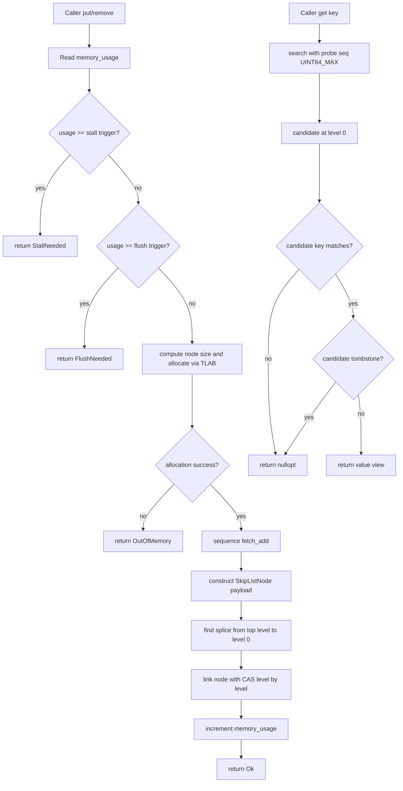
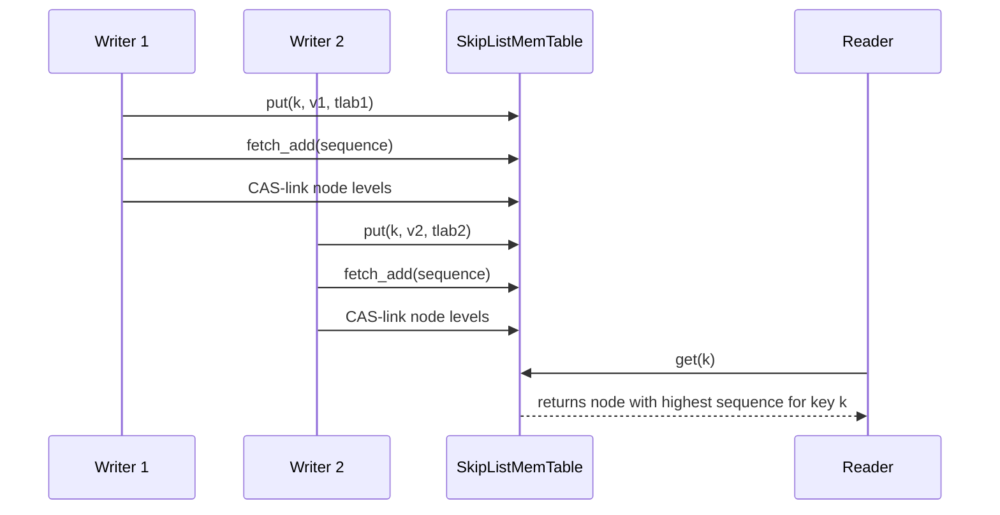
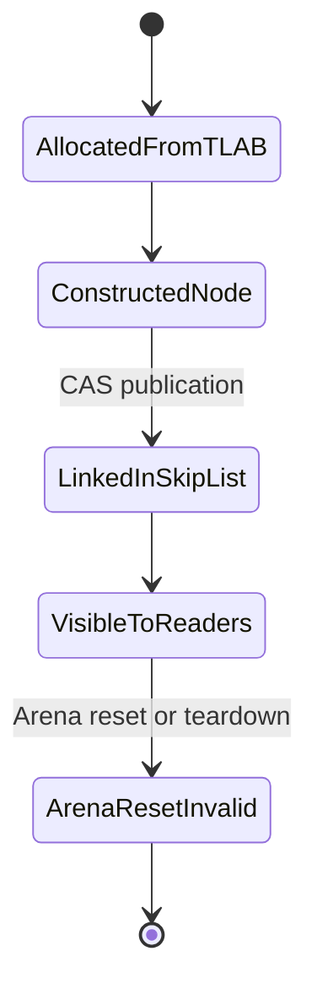

# SkipList MemTable Architecture

Author: Ankit Kumar
Date: 2026-04-23

## Last Updated
2026-04-23

## Change Summary
- 2026-04-23: Created architecture documentation for MemTable abstraction and SkipListMemTable implementation, including lock-free insertion flow, sequence/version ordering, memory thresholds, and validation coverage.
- 2026-04-23: Added related-document navigation and tightened contract-level notes for `IsMemTable` interoperability.

## Purpose
Document the in-memory write-path index model used by StrataDB in phase 3, including the generic MemTable contract and the concrete skip-list implementation.

## Overview
`SkipListMemTable` is a lock-free, append-versioned in-memory index backed by `Arena` and writer-local `TLAB` allocation. The component serves three goals:

1. Accept writes (`put`, `remove`) without global writer mutexes.
2. Return latest visible value for a user key (`get`) using version ordering.
3. Provide sorted forward iteration (`scan`) for flush/compaction handoff.

The generic contract is encoded as a C++ concept (`IsMemTable`) so compile-time checks enforce a stable API for any future memtable implementation.

## System Model
The memtable subsystem has two layers:

| Layer | Type | Responsibility | Ownership Model |
| --- | --- | --- | --- |
| Contract layer | `IsMemTable` concept | Defines required API and return-type contracts | Compile-time only |
| Implementation layer | `SkipListMemTable` | Stores key versions in concurrent skip list nodes | Runtime object shared by readers/writers |

### MemTable Concept Contract
`include/stratadb/memtable/memtable_concept.hpp` requires:

| Required API | Signature Shape | Contract |
| --- | --- | --- |
| Insert value | `put(key, value, tlab)` | Returns `PutResult`-compatible status |
| Insert tombstone | `remove(key, tlab)` | Returns `PutResult`-compatible status |
| Point lookup | `get(key)` | Returns `std::optional<std::string_view>` |
| Memory accounting | `memory_usage()` | Returns `std::size_t` |
| Flush signal | `should_flush()` | Boolean-convertible flush trigger |
| Ordered traversal | `scan(visitor)` | Calls visitor with `T::EntryView` in sorted order |

`SkipListMemTable` is validated by `static_assert(IsMemTable<SkipListMemTable>)`.

### Runtime State Model
| State | Backing Field | Update Path |
| --- | --- | --- |
| Head sentinel | `head_` | Allocated once in constructor |
| Version counter | `sequence_` (`std::atomic<uint64_t>`) | `fetch_add` on successful insert path |
| Memory accounting | `memory_usage_` (`std::atomic<size_t>`) | Increased by inserted node allocation size |
| Flush/stall policy | `flush_trigger_bytes_`, `stall_trigger_bytes_` | Construct-time snapshot from `MemTableConfig` |

## Architecture / Design

| Area | Implementation | Why It Matters |
| --- | --- | --- |
| Index form | Probabilistic skip list with max height 12 | Sub-linear search while retaining ordered scan path |
| Key ordering | `(user_key ascending, sequence descending)` | Latest version for a key appears first in key group |
| Node allocation | `TLAB::allocate(size, 8-byte alignment)` | Writer-local fast allocation with Arena backing |
| Link publication | Per-level CAS with release/acquire semantics | Readers observe fully-initialized node payload after link |
| Backpressure | `PutResult::{FlushNeeded, StallNeeded}` thresholds | Write path can signal flush/stall to upper layers |
| Delete semantics | Tombstone node (`ValueType::TypeDeletion`) | Removes visible value without immediate physical delete |

## Data Flow

### Thread Interaction

### Memory Lifecycle

## Components

### MemTable Concept (`IsMemTable`)
#### Responsibility
Define the minimum API and type contracts for memtable implementations.

#### Why This Exists
Without a concept-level contract, alternate memtable implementations can silently drift in return types and behavioral surface.

#### How It Works
A constrained `requires` expression checks presence and return compatibility for `put`, `remove`, `get`, `memory_usage`, `should_flush`, and `scan` with `T::EntryView`.

#### Concurrency Model
None directly. It is compile-time validation only.

#### Trade-offs
Strong interface guarantees at compile time, but concept checks cannot enforce runtime semantics such as linearizability or fairness.

### SkipListMemTable Core
#### Responsibility
Maintain ordered in-memory versions and support concurrent reads/writes.

#### Why This Exists
Write-heavy workloads need an in-memory structure with cheap append-version insertion and ordered traversal for downstream flush logic.

#### How It Works
- Constructor allocates a sentinel head node with `MAX_HEIGHT` and null next pointers.
- `put` inserts value nodes with randomized height.
- `remove` inserts tombstones at height 1.
- `get` performs top-down search and returns first matching non-tombstone node.
- `scan` walks level-0 list and emits immutable `EntryView` snapshots.

#### Concurrency Model
- Writers race through CAS link operations per level.
- Readers traverse with acquire loads only.
- No global lock exists in insert/search paths.
- Sequence generation is atomic and monotonic per process lifetime.

#### Trade-offs
High writer concurrency and simple read traversal, but no in-place update/delete compaction; obsolete versions remain until a higher-level flush/compaction stage consumes them.

### Splice Search and Link Path
#### Responsibility
Find predecessor/successor frontier for insertion and safely publish new nodes.

#### Why This Exists
CAS insertion requires stable predecessor candidates per level.

#### How It Works
- `find_splice(user_key, seq)` descends from highest level to 0.
- `link_node` publishes each level from 0 upward.
- On CAS failure, splice is recomputed to avoid stale predecessor chains.

#### Concurrency Model
- CAS uses release on success, acquire on failure path reload.
- Reader acquire-load traversal observes published next pointers.

#### Trade-offs
Recomputing splice after CAS failure simplifies correctness under contention but increases work when many writers target nearby keys.

### Threshold and Result Signaling
#### Responsibility
Expose write-path backpressure to the caller.

#### Why This Exists
Upper layers need explicit, non-throwing signals for flush and stall decisions.

#### How It Works
`put`/`remove` check memory usage before insertion and return:

| Result | Trigger |
| --- | --- |
| `Ok` | Insert completed |
| `FlushNeeded` | `memory_usage >= flush_trigger_bytes` |
| `StallNeeded` | `memory_usage >= stall_trigger_bytes` |
| `OutOfMemory` | Allocation or size computation failed |

#### Concurrency Model
`memory_usage_` is read with relaxed ordering; threshold signaling is eventually consistent under concurrent writers.

#### Trade-offs
Cheap checks and explicit status codes, but threshold crossing is advisory and may race with other writers.

## Key Design Decisions
| Decision | Why | Alternative Rejected | Trade-off |
| --- | --- | --- | --- |
| Compile-time memtable contract via concept | Keep implementation substitutions type-safe | Informal comment-only interface | Runtime behavior still needs tests |
| Sort by `(key asc, seq desc)` | Fast latest-version lookup per key | Separate per-key version list | Insert path must compare both key and sequence |
| Tombstone as normal node | Reuse insertion and ordering logic | Side tombstone map | Tombstones consume memtable memory until flush |
| Lock-free per-level CAS insertion | Avoid global writer lock bottleneck | Single mutex around all writes | Contention can trigger repeated splice recomputation |
| Sequence packed into node key trailer | Keep version ordering local to node compare | External version map | Fixed sequence bit budget (56 bits) |
| Threshold checks before insert | Fast backpressure signal | Insert-first then reject later | Race windows around concurrent memory growth |

## Failure Modes
| Scenario | Cause | Impact | Mitigation |
| --- | --- | --- | --- |
| Constructor terminates process | Head sentinel allocation fails | Memtable unusable | Treat Arena setup failure as fatal and fail startup early |
| Write returns `OutOfMemory` | `allocation_size` overflow guard or `TLAB` allocation failure | Caller cannot insert entry | Trigger flush/stall workflow and provision memory budget |
| Sequence overflow terminates process | `sequence_ > SkipListNode::MAX_SEQUENCE` | Hard stop on version counter exhaustion | Not verified: long-term rollover policy; requires future design |
| Frequent CAS retries | High write contention near same search frontier | Higher tail latency for writes | Shard write keys, flush earlier, or tune workload partitioning |
| Flush/stall thresholds oscillate | Concurrent writers race around trigger boundaries | Variable write acceptance | Apply hysteresis/policy in caller pipeline |
| Dangling string_view risk | Caller reads views after Arena reset/teardown | Undefined behavior in caller | Keep returned views within Arena lifetime boundary |

## Observability
- Source files:
  - `include/stratadb/memtable/memtable_concept.hpp`
  - `include/stratadb/memtable/skiplist_memtable.hpp`
  - `src/memtable/skiplist_memtable.cpp`
  - `tests/memtable/skiplist_memtable_test.cpp`
- Immediate health signals:
  - `memory_usage()` growth
  - `should_flush()` transitions
  - Distribution of `PutResult` values (`Ok`, `FlushNeeded`, `StallNeeded`, `OutOfMemory`)
- Debug focus points:
  - `compare_impl` ordering behavior
  - `find_splice` frontier correctness
  - `link_node` CAS retry frequency

## Validation / Test Matrix
| Test | What It Verifies | Safety Property |
| --- | --- | --- |
| `ConceptSatisfied` | `SkipListMemTable` models `IsMemTable` | Compile-time API contract correctness |
| `EmptyGetReturnsNullopt` | Missing-key lookup behavior | No false positive reads on empty table |
| `PutGetAndOverwriteLatestWins` | Reinsert same key returns latest value | Version ordering correctness |
| `RemoveCreatesTombstone` | Tombstone hides previous value | Logical delete visibility |
| `FlushThresholdBlocksWrites` | Flush threshold result signaling | Backpressure correctness |
| `StallThresholdReturnsStallNeeded` | Stall threshold result signaling | Write throttling signal correctness |
| `MemoryUsageTracksSuccessfulInserts` | Memory accounting monotonicity | Usage tracking correctness |
| `LongKeyRoundTrip` | Long key/value storage and retrieval | Payload integrity beyond prefix optimization |
| `LargeBatchRoundTrip` | Many unique key writes/reads | Basic scalability and ordering robustness |
| `ScanProvidesSortedForwardView` | Sorted key scan and descending sequence for same key | Iteration ordering correctness |
| `ConcurrentUniqueInserts` | Multi-threaded writes on unique keys | Lock-free insertion safety under concurrency |
| `ConcurrentSameKeyLastWriterVisible` | Concurrent writes to same key | Latest visible version non-empty post-join |

## Performance Characteristics
| Path | Dominant Work | Notes |
| --- | --- | --- |
| `get` | Top-down skip-list traversal with prefix/key compare | Average skip-list search complexity with key+sequence comparator |
| `put`/`remove` uncontended | Allocation + splice walk + few CAS operations | Typically short retry-free path |
| `put`/`remove` contended | Splice recomputation after CAS failures | Tail latency sensitive to writer contention |
| `scan` | Linear walk on level 0 | Suitable for flush/iteration pipeline |

## Usage / Interaction
| Step | Caller Action | Required Condition | Expected Outcome |
| --- | --- | --- | --- |
| 1 | Create `Arena` and per-thread `TLAB` | Arena successfully created | Allocation source ready |
| 2 | Construct `SkipListMemTable(arena, memtable_config)` | Head allocation succeeds | Memtable ready |
| 3 | Call `put` / `remove` with writer-local `TLAB` | Arena memory available | `PutResult` indicates success or control signal |
| 4 | Serve reads through `get(key)` | Arena remains valid | Latest non-tombstone value or `nullopt` |
| 5 | Iterate with `scan(visitor)` when flushing | Visitor handles duplicate keys/versions | Sorted key stream with sequence metadata |
| 6 | Trigger flush/stall from `PutResult` or `should_flush()` | Caller policy configured | Controlled write-path backpressure |

## Related Documents
- [02-configuration-management.md](02-configuration-management.md)
- [03-memory-arena.md](03-memory-arena.md)
- [04-thread-local-allocation.md](04-thread-local-allocation.md)
- [06-skiplist-node.md](06-skiplist-node.md)

## Notes
- Not verified: formal linearizability proof for concurrent same-key writes.
- Not verified: production workload behavior at sequence counter exhaustion horizon.
- Not verified: exact CAS retry distribution under high-contention write mixes.
