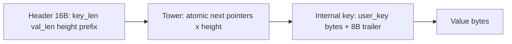

# SkipList Node Architecture

Author: Ankit Kumar
Date: 2026-04-23

## Last Updated
2026-04-23

## Change Summary
- 2026-04-23: Created architecture documentation for SkipListNode binary layout, alignment constraints, trailer encoding, overflow-safe sizing, and node lifecycle semantics.

## Purpose
Explain the exact in-memory representation and invariants of `SkipListNode`, because this struct is the correctness-critical storage unit for key ordering, value visibility, and skip-list linkage.

## Overview
`SkipListNode` is a variable-size object stored in a contiguous allocation:

1. Fixed 16-byte header (lengths, height, key prefix).
2. Variable-height tower (`std::atomic<SkipListNode*>[height]`).
3. Payload bytes containing `internal_key` (user key + trailer) and value.

The representation is optimized for comparison speed (embedded key prefix), ordering (packed sequence + value type trailer), and lock-free traversal (atomic next pointers).

## System Model
Node semantics are split between immutable payload state and mutable linkage state:

| Region | Mutability | Access Pattern |
| --- | --- | --- |
| Header (`key_len_`, `val_len_`, `height_`, `prefix_`) | Immutable after `construct` | Read frequently by compare/search |
| Tower (`next_nodes`) | Mutated during insertion/publish | Atomics read by concurrent traversal |
| Payload (`internal_key` + value) | Immutable after `construct` | Read by `user_key()`, `value()`, `sequence_number()`, `value_type()` |

### Binary Fields and Constants
| Item | Value/Type | Role |
| --- | --- | --- |
| `PREFIX_BYTES` | 7 | Cached first bytes of user key for fast compare |
| `TRAILER_BYTES` | 8 | Packed `sequence` + `ValueType` appended to user key |
| `TYPE_BITS` | 8 | Lower bits reserved for value type |
| `TYPE_MASK` | `(1<<8)-1` | Extracts type from trailer |
| `MAX_SEQUENCE` | `uint64_max >> 8` | 56-bit sequence budget |
| `REQUIRED_ALIGNMENT` | `alignof(std::atomic<SkipListNode*>)` | Required allocation alignment for tower atomics |

## Architecture / Design

| Area | Implementation | Why It Matters |
| --- | --- | --- |
| Header packing | `sizeof(SkipListNode) == 16` static assert | Ensures tower starts at naturally aligned offset |
| Prefix placement | `prefix_` starts at offset 9 | Reuses alignment hole instead of dead padding |
| Trailer encoding | `trailer = (sequence << 8) | type` | Keeps version and tombstone/value marker adjacent to key |
| Overflow-safe sizing | `allocation_size(...)` returns `0` on invalid input/overflow | Prevents wrapped allocation sizes |
| Placement construction | `construct(void* mem, ...)` initializes in caller-provided memory | Integrates with Arena/TLAB allocators without extra heap allocations |
| Accessor split | `internal_key`, `user_key`, `value`, `sequence_number`, `value_type` | Decouples storage encoding from caller-facing semantics |

## Data Flow
```mermaid
flowchart TD
    A[Caller computes allocation_size(height key_len val_len)] --> B{"size == 0?"}
    B -- yes --> C[caller treats as OOM/invalid]
    B -- no --> D[allocate aligned memory from TLAB/Arena]
    D --> E[construct(mem key value seq type height)]
    E --> F[write header and prefix]
    F --> G[initialize atomic tower entries to nullptr]
    G --> H[copy user key bytes]
    H --> I[pack and copy 8-byte trailer]
    I --> J[copy value bytes]
    J --> K[node ready for skip-list linking]

    K --> L[user_key/value/sequence/type accessors]
```

### Memory Layout


### Memory Lifecycle
```mermaid
stateDiagram-v2
    [*] --> RawAlignedMemory
    RawAlignedMemory --> Constructed: SkipListNode::construct
    Constructed --> Linked: published into skip list
    Linked --> Readable: concurrent traversals
    Readable --> Invalidated: Arena reset or teardown
    Invalidated --> [*]
```

## Components

### `allocation_size(...)`
#### Responsibility
Compute total bytes needed for header + tower + internal key + value, with overflow and range guards.

#### Why This Exists
Node allocations are variable-sized and must avoid integer-wrap bugs that could cause undersized buffers and memory corruption.

#### How It Works
- Rejects `height == 0`.
- Validates key/value lengths against `uint32_t` storage limits.
- Adds each segment with checked arithmetic against `size_t` max.
- Returns `0` on any invalid/overflow condition.

#### Concurrency Model
None directly; pure calculation.

#### Trade-offs
Simple zero-return contract avoids exceptions, but callers must treat `0` as a hard failure path.

### `construct(...)`
#### Responsibility
Materialize a fully initialized node in caller-provided aligned memory.

#### Why This Exists
Skip-list insertion path needs deterministic in-place construction compatible with custom allocators.

#### How It Works
- Asserts alignment and bounds preconditions.
- Writes lengths and height.
- Copies/pads key prefix.
- Placement-constructs tower atomics to `nullptr`.
- Copies user key, packed trailer, then value bytes into payload.

#### Concurrency Model
Construction is single-threaded before publication. After link publication, readers can concurrently access immutable header/payload and atomic tower links.

#### Trade-offs
Efficient contiguous representation, but correctness depends on caller honoring alignment and size preconditions.

### Accessor API
#### Responsibility
Expose decoded node semantics without requiring callers to parse raw bytes.

#### Why This Exists
Centralized decoding avoids duplicated, error-prone trailer parsing logic.

#### How It Works
- `internal_key()` returns user key + trailer bytes.
- `user_key()` slices payload excluding trailer.
- `value()` returns bytes after internal key.
- `value_type()` and `sequence_number()` decode trailer via `TYPE_MASK` and bit shift.

#### Concurrency Model
Read-only payload access after publication; no synchronization beyond traversal pointer loads.

#### Trade-offs
Accessor simplicity improves call sites, but all returned views are non-owning and tied to allocator lifetime.

## Key Design Decisions
| Decision | Why | Alternative Rejected | Trade-off |
| --- | --- | --- | --- |
| 16-byte header invariant | Keep tower start predictable and aligned | Compiler-dependent larger header with implicit padding | Requires strict field layout monitoring |
| Prefix cache in header | Accelerate key comparison fast-path | Compare full key from payload every time | Slightly larger header metadata complexity |
| Packed trailer with sequence+type | Co-locate versioning and delete marker with key ordering bytes | Separate metadata fields elsewhere | Sequence limited to 56 bits |
| Variable-height inline tower | Compact per-node skip-list metadata | External tower allocations | Node size scales with height |
| Checked `allocation_size` arithmetic | Prevent overflow-induced under-allocation | Unchecked arithmetic | Additional branches in size computation |
| Accessors return `string_view` | Zero-copy reads from Arena memory | Owning string copies | Callers must respect Arena lifetime |

## Failure Modes
| Scenario | Cause | Impact | Mitigation |
| --- | --- | --- | --- |
| `allocation_size` returns `0` | Invalid height or overflow/range guard triggered | Insert path must fail allocation | Propagate as `OutOfMemory`/error to caller |
| Debug assertion failure in `construct` | Misaligned memory, invalid height, oversized inputs, or sequence overflow | Process abort in debug builds | Validate inputs and allocator alignment at call site |
| Wrong type/sequence decode | Trailer corruption or invalid write | Visibility and ordering bugs | Keep trailer packing centralized and covered by tests |
| Dangling views | Node memory reclaimed/reset while views still used | Undefined behavior | Keep node-backed views inside Arena lifetime scope |
| Mis-sized tower access | Incorrect `height_` metadata | Out-of-bounds atomic span access | Preserve constructor-only initialization and invariants |

## Observability
- Source files:
  - `include/stratadb/memtable/skiplist_node.hpp`
  - `src/memtable/skiplist_node.cpp`
  - `tests/memtable/skiplist_memtable_test.cpp` (node-focused test cases)
- Invariant signals:
  - Static asserts for header size, prefix offset, and struct alignment
  - Runtime assertions in `construct` for alignment and bounds
  - Test coverage for encode/decode, prefix behavior, and null-initialized tower

## Validation / Test Matrix
| Test | What It Verifies | Safety Property |
| --- | --- | --- |
| `LayoutAndOffsets` | Header size, prefix offset, struct alignment invariants | Binary layout stability |
| `AllocationSizeOverflowGuards` | Invalid/overflow input handling in sizing function | No wrapped size calculations |
| `ConstructAndDecodeSmallKey` | Correct encode/decode for normal key/value | Payload and trailer integrity |
| `ConstructAndDecodeLongKeyPrefix` | Prefix copy behavior and tombstone decode | Prefix fast-path correctness |
| `NextNodesAreInitializedToNull` | Tower atomics start null | Safe insertion baseline |
| `RejectsOverflowSizedPayloads` | Guard behavior for huge lengths | Defensive bounds enforcement |

## Performance Characteristics
| Path | Dominant Work | Notes |
| --- | --- | --- |
| `allocation_size` | Constant-time checked arithmetic | Small branch-heavy helper |
| `construct` | Prefix copy + key/value memcpy + tower initialization | Linear in key/value length and node height |
| Compare-related accessors | Prefix and payload reads + trailer unpack | Zero-copy decode path |

## Usage / Interaction
| Step | Caller Action | Required Condition | Expected Outcome |
| --- | --- | --- | --- |
| 1 | Call `allocation_size(height, key_len, val_len)` | `height >= 1` and representable lengths | Non-zero size or explicit failure signal |
| 2 | Allocate memory with at least `REQUIRED_ALIGNMENT` | Arena/TLAB provides aligned block | Writable region for node |
| 3 | Call `construct(mem, key, value, seq, type, height)` | Sequence <= `MAX_SEQUENCE` | Fully initialized node |
| 4 | Publish via skip-list link path | Correct synchronization in memtable | Concurrent readers can traverse node |
| 5 | Read via accessors and `next_nodes()` | Node still alive in Arena | Zero-copy decoded views |

## Notes
- Not verified: quantitative impact of prefix caching on real production key distributions.
- Not verified: long-run operational policy once 56-bit sequence capacity is approached.
