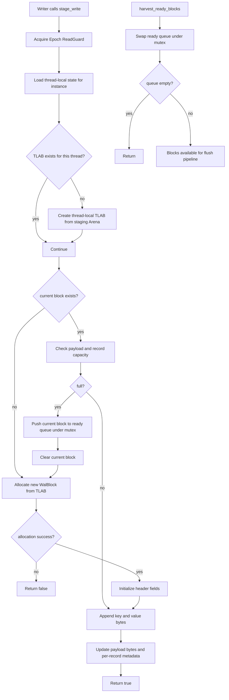
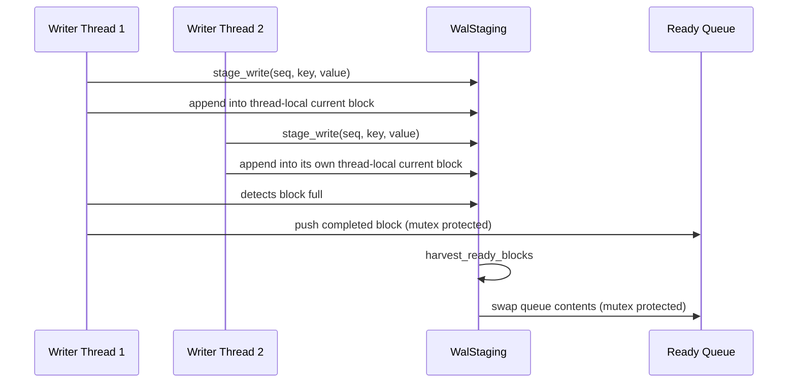
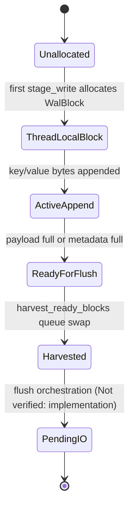

# WAL Staging Architecture

Author: Ankit Kumar
Date: 2026-04-27

## Last Updated
2026-04-27

## Change Summary
- 2026-04-27: Created WAL staging architecture documentation from current code, covering block layout, thread-local staging state, handoff queue behavior, and known unimplemented flush pipeline boundaries.

## Purpose
Document the current in-memory WAL staging path used before durable persistence, including exactly what is implemented and what is still intentionally incomplete.

## Overview
WAL staging in the current repository is a pre-flush assembly path:

1. Writers call stage_write(sequence, key, value).
2. Data is appended into a thread-local current WalBlock allocated from Arena-backed TLAB.
3. Full blocks are moved into a ready queue under a mutex.
4. harvest_ready_blocks drains the queue for flush handling.

Important boundary: actual disk I/O orchestration is not implemented in this component yet. The harvest path currently drains ready blocks but does not issue writes.

## System Model
| Layer | Type | Responsibility | Ownership Model |
| --- | --- | --- | --- |
| Physical block layout | WalBlock<BlockSize> | Header, tearing matrix, metadata, payload packing | Value type in Arena/TLAB memory |
| Staging engine | WalStaging<BlockSize> | Append records and handoff completed blocks | Shared object with thread-local writer state |
| Type dispatch surface | WalManager variant | Select block size specialization | Single manager instance wrapper |

| Sector Mode | Block Size | Variant Type |
| --- | --- | --- |
| Legacy HDD | 512 | WalStaging<SectorSize::LegacyHDD> |
| Standard NVMe | 4096 | WalStaging<SectorSize::StandardNVMe> |
| Advanced Format | 8192 | WalStaging<SectorSize::AdvancedFormat> |
| Enterprise NVMe | 16384 | WalStaging<SectorSize::EnterpriseNVMe> |

## Architecture / Design
| Area | Current Implementation | Why It Matters |
| --- | --- | --- |
| Block alignment | WalBlock is alignas(BlockSize) | Keeps block storage and metadata aligned with physical boundary assumptions |
| Header model | sequence, physical_lba, payload/header CRC fields, epoch, payload bytes, record count | Supports future durability/recovery checks and partial-write diagnostics |
| Tearing matrix | One byte per cache line in block payload region (padded) | Supports cache-line-level atomicity/tearing detection strategy |
| Record metadata | Fixed MAX_RECORDS arrays for opcodes and key lengths | Enables compact side metadata lookup for payload parsing |
| Writer state | thread_local array indexed by instance_id | Avoids global per-write allocator and synchronization overhead |
| Handoff queue | ready_blocks_ protected by handoff_mutex_ | Allows producer threads to pass full blocks to flusher path |

## Data Flow

### Thread Interaction

### Memory Lifecycle

## Components
### WalBlock<BlockSize>
#### Responsibility
Define physical block memory layout for WAL staging payload and metadata.

#### Why This Exists
Durability and recovery logic need deterministic on-media framing independent of caller payload shape.

#### How It Works
- Header is cache-line aligned and fixed-size.
- Tearing matrix size scales with block cache-line count and is cache-line padded.
- VectorMetadata stores per-record opcodes and key lengths with fixed MAX_RECORDS.
- Payload region consumes remaining bytes in block.

#### Concurrency Model
WalBlock itself is not internally synchronized. Mutations occur through owning writer thread before handoff.

#### Trade-offs
Predictable binary layout and alignment guarantees, at the cost of fixed metadata capacity per block.

### WalStaging<BlockSize>
#### Responsibility
Stage incoming records into thread-local blocks and hand off completed blocks to flush pipeline.

#### Why This Exists
Write path should not block on immediate disk flush for every operation.

#### How It Works
- Each staging instance gets unique instance_id up to MAX_DB_INSTANCES.
- Each thread has thread-local state array indexed by instance_id.
- stage_write creates thread-local TLAB lazily, allocates block on first use, appends key and value bytes, and updates header/metadata counters.
- If payload capacity or record capacity is exceeded, current block is moved to ready queue and a new block is allocated.
- harvest_ready_blocks swaps ready queue content into local vector for flush processing.

#### Concurrency Model
- Writer append path is thread-local except ready-queue push.
- Shared ready queue uses std::mutex.
- Epoch read guard is acquired in stage_write scope.

#### Trade-offs
Low write-path coordination overhead, but no durable guarantee until external flush pipeline consumes harvested blocks.

### WalManager Variant Dispatch
#### Responsibility
Select concrete WalStaging specialization based on configured block size constants.

#### Why This Exists
Compile-time block layouts are needed for alignment/static-assert guarantees while runtime config still chooses sector mode.

#### How It Works
WalManager stores std::variant of supported WalStaging specializations and forwards stage_write through std::visit.

#### Concurrency Model
Depends on selected staging instance behavior.

#### Trade-offs
Type-safe specialization set, but block-size choices are closed to declared variant alternatives.

## Key Design Decisions
| Decision | Why | Alternative Rejected | Trade-off |
| --- | --- | --- | --- |
| Templated WalBlock by BlockSize | Preserve compile-time layout invariants and alignment | One runtime-sized dynamic block struct | More template instantiations to maintain |
| Thread-local staging state per instance | Keep hot write path mostly lock-free | Global shared current block | More per-thread memory footprint |
| Mutex-protected ready queue | Simple correctness for producer handoff | Lock-free MPMC queue | Potential contention at very high producer rates |
| Fixed MAX_RECORDS metadata arrays | Bounded metadata footprint and predictable parsing | Variable-length metadata blobs | Hard per-block record-count cap |
| stage_write bool result | Fast failure signal for allocation/full-path issues | Exception-based write path | Less diagnostic detail in return value |

## Failure Modes
| Scenario | Cause | Impact | Mitigation |
| --- | --- | --- | --- |
| Staging instance limit exceeded | instance_id >= MAX_DB_INSTANCES | Process termination | Bound instance count or raise configured limit in code |
| stage_write returns false | TLAB or block allocation failure | Record not staged | Handle failure in caller and trigger pressure response |
| Metadata capacity hit | num_records reaches MAX_RECORDS before payload full | Block sealed earlier than payload exhaustion | Keep record-size distribution in mind for flush cadence |
| Payload capacity hit | key+value does not fit remaining payload bytes | Current block sealed and replaced | Ensure flush thread keeps up to reduce queue growth |
| Data not persisted after harvest | IO path not implemented in this component | Durability gap | Implement flush_pipeline sink and recovery validation |
| Unregistered epoch thread in stage_write | Epoch ReadGuard precondition violation | Assertion/termination in misuse paths | Ensure thread registration policy for WAL writers |

## Observability
- Source files:
  - include/stratadb/wal/wal_block.hpp
  - include/stratadb/wal/wal_staging.hpp
  - include/stratadb/wal/wal_manager.hpp
  - src/wal/wal_staging.cpp
- Primary signals:
  - stage_write success/failure rate
  - ready queue growth behavior
  - harvest cadence
- Not verified: runtime counters or tracing hooks for queue depth and flush latency are not currently exposed.

## Validation / Test Matrix (Optional)
| Scenario | Current Status | Notes |
| --- | --- | --- |
| WalBlock layout invariants | Partially validated by static_asserts | compile-time checks exist for size/offset constraints |
| Staging append correctness | Not verified | no dedicated WAL staging unit tests in current repository |
| Harvest handoff correctness | Not verified | requires focused tests around queue behavior and lifecycle |
| End-to-end durability | Not verified | flush pipeline and replay path are not documented as complete |

## Performance Characteristics (Optional)
| Path | Dominant Work | Notes |
| --- | --- | --- |
| stage_write hot path | memcpy + header metadata updates | Mostly thread-local until queue handoff |
| Block rollover | Mutex push to ready queue + new block allocation | Sensitive to block-size fit and record size distribution |
| harvest_ready_blocks | Mutex swap of vector | Cheap transfer primitive; downstream flush cost external |

## Usage / Interaction
| Step | Caller Action | Required Condition | Expected Outcome |
| --- | --- | --- | --- |
| 1 | Construct WalStaging/WalManager with EpochManager and staging Arena | Valid subsystem lifetimes | WAL staging object ready |
| 2 | Register writer threads with EpochManager | Before stage_write use | ReadGuard preconditions satisfied |
| 3 | Call stage_write for each mutation | Sufficient Arena capacity | Record appended or explicit false result |
| 4 | Run harvest_ready_blocks in flush thread | Completed blocks accumulated | Ready blocks transferred for flush handling |
| 5 | Persist harvested blocks | Not verified: implementation pending | Durable WAL behavior once implemented |

## Related Documents
- [00-build-and-toolchain.md](00-build-and-toolchain.md)
- [01-epoch-reclamation.md](01-epoch-reclamation.md)
- [03-memory-arena.md](03-memory-arena.md)
- [04-thread-local-allocation.md](04-thread-local-allocation.md)

## Notes
- Not verified: final durability semantics because disk flush pipeline and recovery integration are incomplete in current code.
- Not verified: contention profile of ready queue under high multi-writer load.
- Not verified: relationship between WalConfig target flush latency and current runtime behavior.
