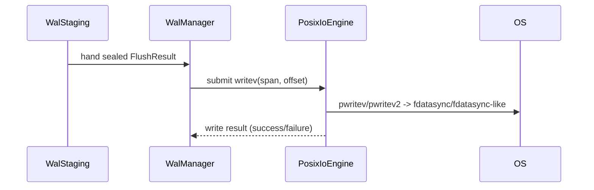

# IO Engine Physics

Author: Ankit Kumar  
Date: 2026-05-17

## Last Updated
2026-05-17

## Change Summary
- 2026-05-17: New document. Explains the separation between IO mechanism (`PosixIoEngine`) and WAL policy (`WalManager`), the `IOCapabilities` probe, why `fallocate()` is necessary for HDDs, and the macOS `F_FULLFSYNC` trap for forcing physical flushes.

## Purpose
Record the non-obvious, platform-dependent semantics that the I/O engine and the WAL manager rely on. This is a high-signal reference for implementers who must reason about durability, atomicity, and performance on different storage media.

## Overview
The codebase separates mechanism (how to perform reads/writes/syncs) from policy (which spans to hand to the engine). `PosixIoEngine` implements the mechanism and exposes `IOCapabilities` (logical/physical sector size, rotational flag, support for FUA/RWF atomic writes, and whether `fallocate()` is supported). `WalManager` chooses block layouts based on those capabilities; it does not itself perform low-level writev/pwritev.

Key code facts:
- `IOCapabilities` is defined in [include/stratadb/io/io_concept.hpp](include/stratadb/io/io_concept.hpp) and includes `logical_sector_size`, `physical_sector_size`, `is_rotational`, `supports_rwf_atomic`, and `supports_fallocate`.
- The runtime probe is implemented in [src/utils/hardware.cpp](src/utils/hardware.cpp).
- `PosixIoEngine` uses `pwritev`/`pwritev2(RWF_ATOMIC)` and `fdatasync` in [src/io/posix_io_engine.cpp](src/io/posix_io_engine.cpp).
- macOS requires `F_FULLFSYNC` to force drive platter flushes; the helper `sync_data()` in [src/utils/os.cpp](src/utils/os.cpp) selects this path on Apple.

## Separation of Mechanism vs Policy
| Role | Responsible component | What it decides |
| --- | --- | --- |
| Mechanism | `PosixIoEngine` | How to perform `writev`, `read`, and `sync` given `IOCapabilities`.
| Policy | `WalManager` / staging | Which memory span (sector-aligned sealed block) to hand to the engine and which block layout to choose.

Mermaid (interaction):

## IOCapabilities — what to probe and why
`IOCapabilities` (see `io_concept.hpp`) contains the small set of properties the WAL code reads at startup:
- `logical_sector_size`: minimum alignment for I/O operations. `PosixIoEngine` asserts offsets and buffer alignment against this.
- `physical_sector_size`: physical sector size reported by the device — relevant for choosing `GammaBlock` vs `DeltaBlock` in `WalManager`.
- `is_rotational`: heuristic that determines whether to prefer `DeltaBlock` semantics (per-sector CRCs and seek-avoidant layout).
- `supports_rwf_atomic`: if true, `PosixIoEngine` will attempt `pwritev2(..., RWF_ATOMIC)` to perform kernel-level atomic writes (Linux 6.11+ semantics).
- `supports_fallocate`: filesystems that support `fallocate()` let the engine preallocate extents to avoid heavy fragmentation and metadata operations on HDDs.

The probe in [src/utils/hardware.cpp](src/utils/hardware.cpp) builds a conservative `IOCapabilities` and enables `supports_rwf_atomic` only when the syscall and kernel support are detected.

## Why `fallocate()` is essential for HDDs
What: `fallocate()` preallocates disk extents without writing zeros, allowing IO engines to create contiguous extents and avoid expensive metadata updates during writes.

Why for HDDs specifically:
- Mechanical seek costs dominate HDD latency. Fragmented allocations cause extra seeks and reduce throughput. Preallocating contiguous extents keeps sequential WAL writes physically adjacent.
- Without `fallocate()`, filesystems may create extents lazily (on first write) and interleave metadata operations with payload writes, amplifying latency variability.

How the codebase should use it:
- At WAL creation time, prefer to call `fallocate()` (or equivalent) when `IOCapabilities.supports_fallocate` is true and `is_rotational` is true. This is a policy decision (WalManager / higher-level service) rather than the IO engine mechanism.

Trade-offs:
- `fallocate()` consumes actual disk space (or reserves it logically). For small or highly dynamic workloads this may be wasteful.
- Not all filesystems or mount options support `fallocate()` reliably; code must read `supports_fallocate` from the probe and degrade gracefully.

## macOS `F_FULLFSYNC` trap
Fact: `fdatasync()` on macOS does not guarantee that the drive's volatile write cache is flushed to physical platters. `F_FULLFSYNC` is the only portable way on macOS to ask the OS to force the hardware to persist to media. See [src/utils/os.cpp](src/utils/os.cpp).

Implication:
- On macOS, calling `fdatasync()` alone may leave data in the device's volatile cache. The code uses `fcntl(fd, F_FULLFSYNC)` for strict durability when running on Apple platforms (helper `sync_data()` in `os.cpp`).

## PosixIoEngine implementation notes
- Alignment: `PosixIoEngine::writev` asserts `offset % caps_.logical_sector_size == 0` and that buffers are aligned to `caps_.logical_sector_size`.
- Atomic writes: when `caps_.supports_rwf_atomic` is true, the engine calls `pwritev2(..., RWF_ATOMIC)` (Linux specific) to request kernel-atomic behavior; otherwise it falls back to `pwritev`.
- Sync: `sync()` maps to `fdatasync()` on Linux; on macOS the `sync_data()` helper uses `F_FULLFSYNC` for physical flush.
- Error mapping: the engine maps `errno` to `IOError::AlignmentViolation`, `IOError::DeviceFull`, or `IOError::HardwareError` to keep the API small and machine-readable.

## Practical guidance for integrators
- At startup probe `IOCapabilities` once per WAL file/device and choose the staging pipeline accordingly (`WalManager` already does this decision based on `is_rotational` and `hw_sector_size`).
- When targeting HDDs: preallocate via `fallocate()` if available, choose `DeltaBlock` layout, and prefer to seal sectors early to avoid long RMW.
- When targeting SSDs: choose `GammaBlock` when `supports_rwf_atomic` or when `physical_sector_size` indicates enterprise LBAs; use whole-block `XXH3` finalization and rely on the engine to issue overlapping overwrites where necessary.
- Always add unit tests that exercise the exact write+sync sequence used in production; small differences in ordering or syscall choice can change durability behavior across kernels and firmware.

## Observability
- Expose startup `IOCapabilities` in logs. At minimum emit `logical_sector_size`, `physical_sector_size`, `is_rotational`, `supports_rwf_atomic`, and `supports_fallocate`.
- Trace writev and sync latencies and expose whether `pwritev2(RWF_ATOMIC)` or fallback `pwritev` was used.

## Notes
- Not verified: exact drive behavior for enterprise NVMe models — these vary by vendor and firmware; test on target hardware.  
- Not verified: interactions with network-attached storage (NFS) or virtualized block devices; capabilities probe may lie or be constrained by hypervisor.
