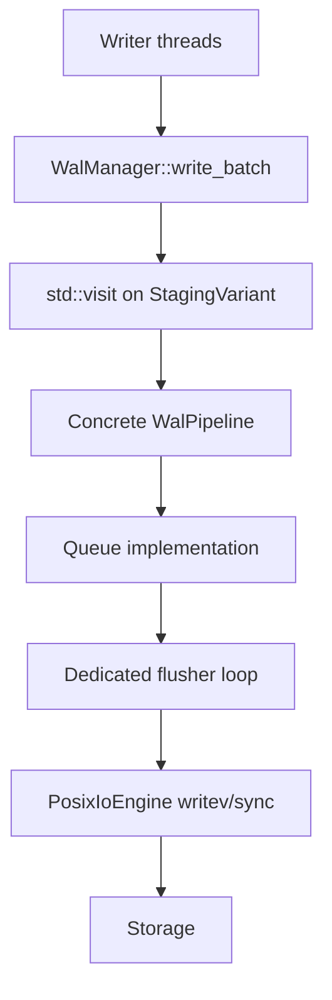
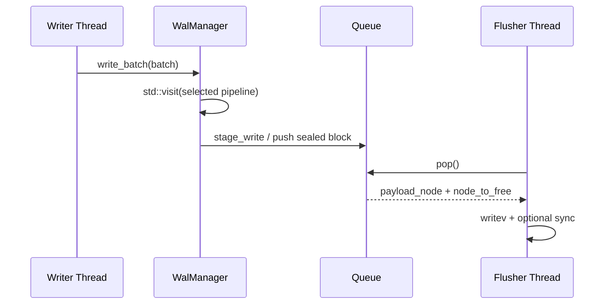

# WAL Concurrency Design

Author: Ankit Kumar  
Date: 2026-05-18

## Last Updated
2026-05-24

## Change Summary
- 2026-05-24: Rewritten to match the current concrete `VyukovMpscQueue` and `SpscMailboxQueue` implementations, the six-cell staging matrix, and the resolved-config selection path in `WalManager`.
- 2026-05-18: Created the WAL concurrency reference covering MPSC vs SPSC, the graceful-degradation boot tree, Vyukov intrusive MPSC rationale, and the SPSC mailbox/zero-latency path.

## Purpose
Explain the OS- and CPU-level thread physics governing WAL handoff, justify the queue choices, and document how `WalManager` selects one pipeline cell from the compile-time matrix at construction time.

## Overview
The current WAL path is a two-axis matrix: `WalPipeline<Layout, Queue>` combines a physical block layout (`GammaBlock` or `DeltaBlock`) with a queue implementation (`VyukovMpscQueue` or `SpscMailboxQueue`). `WalManager` probes device capabilities, reads the resolved `WalConfig`, stores one concrete pipeline in `StagingVariant`, and uses `std::visit` once per batch so the hot record loop still sees fully concrete types.

The concurrency question is therefore not "virtual dispatch or not" but "which queue physics do we want for this deployment": many-writer MPSC with a sleeping consumer, or per-writer SPSC mailboxes with a busy-polling flusher.

## System Model
| Concept | What | Code reference |
| --- | --- | --- |
| Pipeline type matrix | `WalPipeline<Layout, Queue>` combines block layout and queue implementation; `StagingVariant` stores one selected alternative | [include/stratadb/wal/pipeline.hpp](include/stratadb/wal/pipeline.hpp), [include/stratadb/wal/pipeline_variant.hpp](include/stratadb/wal/pipeline_variant.hpp), [include/stratadb/wal/manager.hpp](include/stratadb/wal/manager.hpp)
| MPSC queue implementation | `VyukovMpscQueue` intrusive lock-free MPSC queue with a sleeping consumer | [include/stratadb/wal/queue/vyukov_mpsc_queue.hpp](include/stratadb/wal/queue/vyukov_mpsc_queue.hpp)
| SPSC mailbox implementation | `SpscMailboxQueue` per-thread ring-buffer mailbox array with busy-poll flusher behavior | [include/stratadb/wal/queue/spsc_mailbox_queue.hpp](include/stratadb/wal/queue/spsc_mailbox_queue.hpp)
| Device probe | `IOCapabilities` supplies rotational flag, physical sector size, and atomic-write support | [include/stratadb/io/io_concept.hpp](include/stratadb/io/io_concept.hpp), [src/utils/hardware.cpp](src/utils/hardware.cpp)

## Data Flow


### Thread Interaction


## 1. The MPSC vs SPSC Dilemma

What: SPSC (single-producer single-consumer) gives each writer its own mailbox, so the push path is uncontended and the flusher can sweep mailboxes in a fixed round-robin loop. MPSC permits many writers to share one handoff queue, which is simpler when the deployment has multiple writers and no strict core isolation.

Why it matters: At the CPU level, naive contention on shared variables (a single mutex protecting a handoff queue, or a single cache line frequently written by many cores) causes cache-line bouncing under MESI. When multiple cores repeatedly write the same cache line, ownership migrates between cores and memory-coherence traffic skyrockets, producing high latency and poor scalability.

How (cache physics):
- If 8 threads contend on one mutex or a single-tail pointer in an MPSC structure, the cache line containing that pointer will be transferred between cores on each update (invalidations and exclusive ownership transfers under MESI). Each transfer requires an inter-core coherence message and may serialize updates.

Trade-offs:
- SPSC (when viable): Each writer sees zero cross-writer contention because it owns one mailbox. The flusher pays an O(MAX_SUPPORTED_THREADS) sweep cost.
- MPSC (general): One shared queue is cheaper to enumerate and easier to sleep on, but every push touches a shared tail pointer.

## 2. Selection Tree

What: `WalManager` does not perform autonomous discovery; it receives a resolved `WalConfig` and uses that plus `IOCapabilities` to choose one cell from the staging matrix.

Why: Separating resolution from construction keeps the manager deterministic and makes the pipeline choice visible at one call site.

How it works:
1. `WalManager` probes `IOCapabilities` in the constructor.
2. Layout choice is driven by media physics: rotational media uses `DeltaBlock<4096>`; non-rotational media uses `GammaBlock<4096>` unless `physical_sector_size == 16384`, in which case `GammaBlock<16384>` is selected.
3. Queue choice is driven by the resolved SPSC mode: `ManualOverride` selects `SpscMailboxQueue`; otherwise `VyukovMpscQueue` is selected.
4. The chosen layout and queue form one `WalPipeline<Layout, Queue>` cell inside `StagingVariant`.
5. `write_batch()` resolves the variant once per batch with `std::visit` and stages every record through the concrete pipeline.

Notes: Any higher-level auto-discovery of isolated cores must happen before `WalManager` construction. The manager itself only consumes the resolved setting.

## 3. Vyukov's Intrusive MPSC

What: `VyukovMpscQueue` is the fallback when many writers share one queue. It uses a single atomic exchange on the producer tail and a consumer-visible dummy head node so the consumer can pop whole batches without taking a mutex.

Why: Compared to coarse mutexes, Vyukov avoids kernel transitions and limits coherence to a small set of cache lines. Enqueue operations use a single atomic exchange that hands newly appended entries into a shared head pointer; the consumer later traverses the list, unlinking the batch.

How (implementation notes / primitives):
- Producer-side: `push()` clears `node->next`, exchanges `tail_` with the new node using `acq_rel`, and then links `prev->next` with a release store.
- Consumer-side: `pop()` loads `head_`, checks whether the queue is structurally empty or whether a producer is in the brief link window, and either returns an empty result or advances `head_` to the next payload node.
- Power efficiency: `wait_for_work()` uses `std::atomic::wait` on `consumer_sleeping_`, and `force_wakeup()` notifies the sleeping consumer when shutdown or new work requires it.

Trade-offs:
- The producer path is compact and wait-free, but the consumer must tolerate the short period between the tail exchange and the next-pointer link.
- Sleep/wake behavior is more power-friendly than busy polling, but wake latency depends on the scheduler and the atomic wait path.

## 4. SPSC Mailbox Queue

What: `SpscMailboxQueue` gives each dense thread index its own bounded ring buffer. The writer pushes into its private mailbox, and the flusher sweeps mailboxes in round-robin order.

Why: The design removes producer contention entirely when the deployment can tolerate a busy-polling consumer. That makes it a better fit for pinned-core/manual-override setups than for general-purpose multi-writer workloads.

How it reduces latency:
- Producer-side: `push()` uses `utils::get_dense_thread_index()` to pick a mailbox, then spins with `utils::cpu_relax()` until the ring has room.
- Consumer-side: `pop()` scans all `MAX_SUPPORTED_THREADS` mailboxes and returns the first node it finds. It remembers the last successful mailbox index so the scan does not always start at zero.
- Power management: `wait_for_work()` is a thin `cpu_relax()` call. The queue does not sleep because the intended deployment keeps the consumer on a dedicated busy-polling core.

Trade-offs and caveats:
- Busy polling consumes CPU cycles.
- Consumer sweep time is O(MAX_SUPPORTED_THREADS), so very large thread counts increase the pop-side work even though push is contention-free.

### Flusher loop & shutdown lifecycle

This section documents the flusher thread's main loop, wake/shutdown ordering, and reclamation guarantees so readers understand how producers, the queue, and the flusher interact during normal operation and shutdown.

Flusher main loop (conceptual):

```cpp
while (!stop_requested.load()) {
  queue.wait_for_work(); // sleep or busy-poll depending on queue
  while (auto item = queue.pop()) {
    // write the sealed span to the IO engine
    io_engine.writev(item.memory_spans);
    // ensure durability as required (fdatasync/fsync) per policy
    pool.return_block(item.block_ptr);
  }
}

// final drain after stop requested
force_wakeup();
while (auto item = queue.pop()) {
  io_engine.writev(item.memory_spans);
  pool.return_block(item.block_ptr);
}
```

Shutdown ordering (recommended):
1. Set `stop_requested = true` and prevent new writers from entering long-lived batching paths.
2. Producers finishing a `write_batch()` must still be allowed to push sealed blocks or otherwise return blocks to the pool.
3. Call `queue.force_wakeup()` to ensure a sleeping flusher wakes immediately.
4. Flusher drains the queue, performs pending writes and durability operations, returns blocks to the pool, and updates any durable offsets/LSNs.
5. The manager joins the flusher thread and finalizes any higher-level state.

Wake semantics and edge cases:
- For `VyukovMpscQueue`, producers use `force_wakeup()` to notify a sleeping consumer; the consumer uses `atomic::wait`/`notify_one` patterns to sleep efficiently.
- For `SpscMailboxQueue`, the flusher is expected to busy-poll; shutdown relies on a `stop_requested` flag and a final `force_wakeup()` to break out of the polling loop and drain mailboxes.
- Producers that push during shutdown must be tolerant: either the push succeeds and the flusher will process the item, or the push fails with a shutdown error that the caller must surface.

Memory reclamation:
- The flusher must only reclaim a block (return to `pool`) after the IO engine has successfully accepted the write and any configured durability operation has completed. Holding on to block pointers until reclamation avoids ABA and use-after-free hazards.
- Ensure that `pool.return_block()` is call-safe from the flusher thread context.


## Implementation Reality & Code Links
`WalPipeline<Layout, Queue>` and the variant dispatch are implemented as templates in [include/stratadb/wal/pipeline.hpp](include/stratadb/wal/pipeline.hpp) and selected via `WalManager` in [include/stratadb/wal/manager.hpp](include/stratadb/wal/manager.hpp). The concrete queues live in [include/stratadb/wal/queue/vyukov_mpsc_queue.hpp](include/stratadb/wal/queue/vyukov_mpsc_queue.hpp) and [include/stratadb/wal/queue/spsc_mailbox_queue.hpp](include/stratadb/wal/queue/spsc_mailbox_queue.hpp).

## Key Design Decisions
| Decision | Why | Alternative Rejected | Trade-off |
| --- | --- | --- | --- |
| Choose queue type at construction time | Keeps the hot path branch-free after `std::visit` | Runtime queue switching per batch | More variants in the matrix |
| Use Vyukov MPSC for general multi-writer handoff | Scales to multiple producers with low syscall overhead | Coarse mutex or lock-based queues | Higher per-handoff latency than SPSC |
| Use per-thread SPSC mailboxes for manual override | Eliminates producer contention when the consumer can busy-poll | One shared queue for every writer | O(MAX_THREADS) consumer sweep |

## Failure Modes
| Scenario | Cause | Impact | Mitigation |
| --- | --- | --- | --- |
| Producer stalls mid-link | Consumer observes the tail exchange before `prev->next` is visible | `pop()` returns empty even though work is in flight | Retry the consumer loop; this is the expected transient window |
| SPSC mailbox fills | Writer outruns the flusher on its private ring buffer | Writer spins in `push()` and burns CPU | Increase mailbox capacity or reduce flush latency |
| Busy-poll core is not actually isolated | Manual override uses a core that receives other work | Higher jitter and lower handoff predictability | Reserve the core at the OS level before enabling SPSC mode |
| Flusher sleeps with stop requested | Queue is empty and shutdown is in progress | Work may appear delayed until wakeup | `force_wakeup()` and `stop_requested` coordination in `WalManager` |

## Observability
- Expose metrics: queue depth, producer retry count, consumer batch size, wakeups per second, and batch flush latency.
- Log the selected pipeline cell at startup: layout choice, queue choice, and the resolved `spsc.mode`.
- Trace `write_batch()`, `push()`, `pop()`, and `wait_for_work()` so stall windows and sleep transitions are visible.

## Notes
- Not verified: precise latency numbers for the queue implementations on representative hardware.
- Not verified: whether SPSC busy-polling remains the right choice for every manual-override deployment profile.
