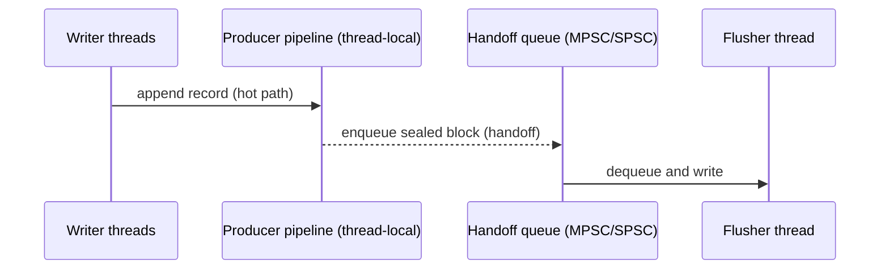

# WAL Concurrency Design

Author: Ankit Kumar  
Date: 2026-05-18

## Last Updated
2026-05-18

## Change Summary
- 2026-05-18: Created the WAL concurrency reference covering MPSC vs SPSC, the graceful-degradation boot tree, Vyukov intrusive MPSC rationale, and the SPSC mailbox/zero-latency path. Notes the current codebase state where SPSC is not implemented and `vyukov_mpsc_queue.hpp` is a stub.

## Purpose
Explain the OS- and CPU-level thread physics governing WAL handoff, justify the chosen concurrency primitives, and document the graceful-degradation boot sequence used to pick SPSC vs MPSC at runtime.

## Overview
This document explains the trade-offs between SPSC and MPSC paths, how cache-coherence (MESI) affects shared-state contention, why we parse `/sys/devices/system/cpu/isolated`, and how the Vyukov intrusive MPSC algorithm fits as the conservative fallback.

## System Model
| Concept | What | Code reference |
| --- | --- | --- |
| Pipeline type matrix | `WalPipeline<Layout, Queue>` — templates over block layout and queue implementation; chosen once at runtime via `std::variant` | [include/stratadb/wal/wal_pipeline.hpp](include/stratadb/wal/wal_pipeline.hpp#L1-L120), [include/stratadb/wal/wal_manager.hpp](include/stratadb/wal/wal_manager.hpp#L1-L200)
| MPSC queue stub | Placeholder `VyukovMpscQueue` exists as a compilation stub in the codebase | [include/stratadb/wal/wal_manager.hpp](include/stratadb/wal/wal_manager.hpp#L1-L100)
| SPSC mailbox stub | Placeholder `SpscMailboxQueue` exists as a compilation stub in the codebase | [include/stratadb/wal/wal_manager.hpp](include/stratadb/wal/wal_manager.hpp#L1-L100)
| OS probing for isolation | `utils::os::auto_discover_isolated_core()` inspects `/sys/devices/system/cpu/isolated` semantics | [include/stratadb/utils/os.hpp](include/stratadb/utils/os.hpp#L1-L120)

## Data Flow (concurrency-focused)

## 1. The MPSC vs SPSC Dilemma

What: SPSC (single-producer single-consumer) can provide extremely low-latency handoffs when one writer thread is paired with a dedicated flusher thread. MPSC (multiple-producer single-consumer) permits many writer threads to hand off to a single flusher without strict pinning requirements.

Why it matters: At the CPU level, naive contention on shared variables (a single mutex protecting a handoff queue, or a single cache line frequently written by many cores) causes cache-line bouncing under MESI. When multiple cores repeatedly write the same cache line, ownership migrates between cores and memory-coherence traffic skyrockets, producing high latency and poor scalability.

How (cache physics):
- If 8 threads contend on one mutex or a single-tail pointer in an MPSC structure, the cache line containing that pointer will be transferred between cores on each update (invalidations and exclusive ownership transfers under MESI). Each transfer requires an inter-core coherence message and may serialize updates.

Trade-offs:
- SPSC (when viable): Minimal coherence traffic — producer and consumer operate on disjoint cache lines for most operations, or the producer writes only to an enqueue slot the consumer later reads. This enables very low-latency handoffs.
- MPSC (general): Easier to integrate with many writers but requires careful lock-free algorithms (e.g., Vyukov) to reduce coherence hotspots. Generally higher per-handoff cost than SPSC but scales better with multiple producers.

## 2. Graceful Degradation Tree (Boot Sequence)

What: At startup we must pick an appropriate pipeline (one cell of the 2D template matrix). The system attempts the lowest-latency option (SPSC pinned to an isolated core) and degrades to more conservative options when requirements aren't met.

Why: Choosing the wrong concurrency mode can either (a) crash or starve the system when resources are insufficient, or (b) provide subpar latency if the environment doesn't support strict isolation or thread pinning. Conservative defaults avoid usability regressions.

Boot steps (high level):
1. Probe CPU count (`utils::logical_core_count()`) — require at least 3 cores to safely consider SPSC (1 writer, 1 flusher, 1 OS work). See [include/stratadb/wal/wal_manager.hpp](include/stratadb/wal/wal_manager.hpp#L1-L200).
2. If `requested_config_.spsc_mode == AutoDiscover`, call `utils::os::auto_discover_isolated_core()` which inspects `/sys/devices/system/cpu/isolated`. Isolated cores are those excluded from general scheduling and thus suitable for busy-polling.
3. Explicitly avoid pinning to logical CPU 0: CPU 0 often receives interrupt handling and kernel background tasks; pinning user-level low-latency threads there defeats isolation and increases jitter.
4. If an isolated core is discovered and validated, convert to `ManualOverride` and pin flusher thread accordingly. Otherwise mark SPSC disabled and use the MPSC pipeline.

Why `/sys/devices/system/cpu/isolated`:
- Linux allows administrators to isolate cores via kernel command-line `isolcpus` or `systemd` settings. Parsing this sysfs entry lets the process discover administrative isolation without requiring privileged introspection.

Notes: This document follows the code's current logic: see `WalManager::compute_effective_config()` in [include/stratadb/wal/wal_manager.hpp](include/stratadb/wal/wal_manager.hpp#L1-L200).

## 3. Vyukov's Intrusive MPSC (The Fallback)

What: Vyukov's MPSC queue is a wait-free/enqueue-fast lock-free algorithm well-suited for many-producer single-consumer scenarios. The typical pattern uses an atomic exchange (XCHG) from producers to append nodes, and a single consumer walks the list to pop batches.

Why: Compared to coarse mutexes, Vyukov avoids kernel transitions and limits coherence to a small set of cache lines. Enqueue operations use a single atomic exchange that hands newly appended entries into a shared head pointer; the consumer later traverses the list, unlinking the batch.

How (implementation notes / primitives):
- Producer-side: a single `std::atomic<Node*> head;` updated via `std::atomic_exchange` (XCHG) to push the producer's node(s) onto the shared list. This is a single atomic write that costs a coherence transfer but is still cheaper than a syscall.
- Consumer-side: the consumer performs an ordered read of `head`, flips it to `nullptr`, and traverses the returned list.
- Power efficiency: to avoid busy-waiting when the queue is empty, the design pairs the atomic producer/consumer algorithm with `std::atomic::wait` (C++20) or futex-based sleeps. Producers can `notify_one` after enqueue; the consumer uses `wait` to sleep, yielding CPU until the next enqueue.

Why `std::atomic::wait` (futex) pairing:
- Spinning consumes CPU and power. The XCHG fast-path handles bursts; outside bursts, using a futex-like `wait` avoids active polling while preserving low wake latency.

Code status: The project presently contains a `VyukovMpscQueue` stub type in [include/stratadb/wal/wal_manager.hpp](include/stratadb/wal/wal_manager.hpp#L1-L120) and an empty header `include/stratadb/wal/vyukov_mpsc_queue.hpp` intended for the concrete implementation. See the file in the workspace — the concrete algorithm is not yet implemented. Marked below as `Not implemented`.

## 4. SPSC Mailbox (Zero-Latency Path)

What: The ideal low-latency path uses an SPSC mailbox with a dedicated flusher thread pinned to an isolated core and a single producing thread that does minimal work to handoff sealed blocks.

How it reduces latency:
- Pinning: `pthread_setaffinity_np` pins the flusher to an isolated CPU so it avoids preemption and scheduling jitter.
- Busy-poll with `PAUSE`: The consumer (flusher) can run a tight loop with `_mm_pause()` or `asm volatile("pause")` to yield briefly between polls. Pausing reduces pipeline pressure and power while still allowing very fast wake-up (nanoseconds), beating kernel wakeups.

Trade-offs and caveats:
- Busy polling consumes CPU cycles; this is only acceptable on admin-designated isolated cores. The system uses `/sys/devices/system/cpu/isolated` to ensure such cores are not shared with other workloads.
- The codebase currently only contains a `SpscMailboxQueue` stub in [include/stratadb/wal/wal_manager.hpp](include/stratadb/wal/wal_manager.hpp#L1-L120). The SPSC mailbox concrete implementation is not present and is `Not implemented` in the repo.

## Implementation Reality & Code Links
- `WalPipeline<Layout, Queue>` and the variant dispatch are implemented as templates in [include/stratadb/wal/wal_pipeline.hpp](include/stratadb/wal/wal_pipeline.hpp#L1-L120) and selected via `WalManager` in [include/stratadb/wal/wal_manager.hpp](include/stratadb/wal/wal_manager.hpp#L1-L240).
- Stubs in the current tree:
  - `VyukovMpscQueue` — stubbed in `wal_manager.hpp` and `vyukov_mpsc_queue.hpp` is empty. Not implemented.
  - `SpscMailboxQueue` — stubbed in `wal_manager.hpp`. Not implemented.

## Key Design Decisions
| Decision | Why | Alternative Rejected | Trade-off |
| --- | --- | --- | --- |
| Prefer SPSC when an isolated core exists | Lowest possible latency when safe | Always use MPSC for simplicity | SPSC requires strict core isolation and increases operational complexity |
| Use Vyukov MPSC as fallback | Scales to multiple producers with low syscall overhead | Coarse mutex or lock-based queues | Higher per-handoff latency than SPSC; simpler to implement and robust across environments |

## Failure Modes
| Scenario | Cause | Impact | Mitigation |
| --- | --- | --- | --- |
| Incorrectly claimed isolated core | Admin misconfiguration or inaccurate parsing | Flusher pinned to a busy core — increased jitter and latency | Validate isolcpus semantics; conservative defaults (prefer MPSC) |
| Absent queue implementations | `vyukov_mpsc_queue.hpp` / SPSC not implemented | System compiles with stubs but runtime may not perform as designed | Implement concrete queue types; add unit tests exercising wake/sleep semantics |

## Observability
- Expose metrics: per-handoff latency histogram, queue length, producer enqueue rate, consumer batch size.
- Instrument OS-level affinity and whether SPSC was selected (log `effective_config_.spsc_mode` and `manual_core_id`). See `WalManager::get_effective_config()`.

## Notes
- Not implemented: concrete `VyukovMpscQueue` and `SpscMailboxQueue` — both present as stubs. See [include/stratadb/wal/vyukov_mpsc_queue.hpp](include/stratadb/wal/vyukov_mpsc_queue.hpp) and [include/stratadb/wal/wal_manager.hpp](include/stratadb/wal/wal_manager.hpp#L1-L120).  
- Not verified: precise latency numbers for busy-poll loops and `std::atomic::wait` integration — these require microbenchmarks on representative hardware.
